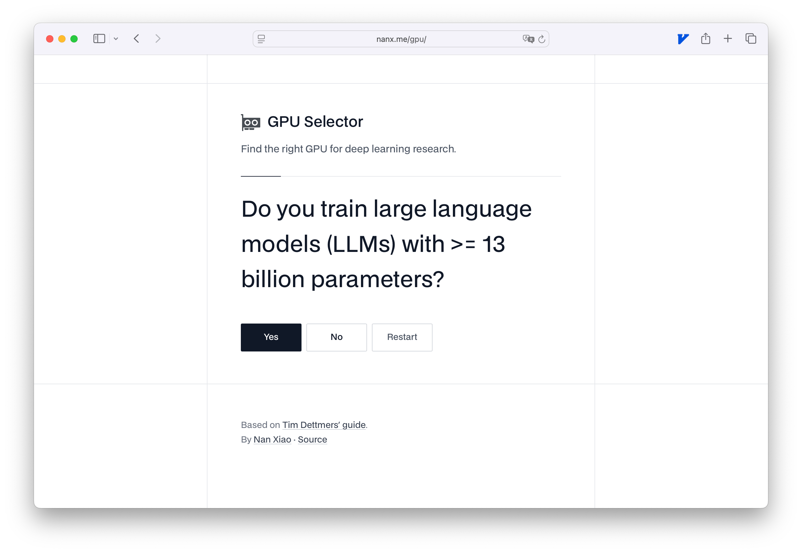

.
](/image/amari-james-bzdfrbaGztY-unsplash.jpg)

In January 2023, I [built](https://nanx.me/blog/post/gpu-selector/) a basic,
interactive [deep learning GPU selector app](https://nanx.me/gpu/) inspired
by Tim Dettmers' popular guide. The original project was a pure HTML + JavaScript + CSS
"vibe coding" experiment, driven by chat with GPT-3.5, which was the SOTA
at the time. While the core logic worked, I did not focus much on its UI or UX.

Now, two and a half years later, I wanted to see how far agentic coding
assistants have come, by refactoring the app with modern tools and design
sensibilities.

## Before and after

Following the wisdom of always using the most expensive but effective tool
for the job... I decided to give the app a fresh look and feel using
Claude Code with Max plan.
Claude Code is a coding assistant with a cool terminal user interface:

Here is the original GPU selector app:

And here is the refactored version:

(Please don't tell me you like the original version better 😅)

## The refactoring process

Here is a high-level summary of my interaction with Claude Code:

- I used Claude Opus 4 until the token limit was reached; after that,
  it switched to Claude Sonnet 4.
- The entire refactor took 13 user instructions.
  The main goals were achieved within the first 7.
- Before starting, I watched the official presentation,
  [Mastering Claude Code in 30 minutes
  ](https://www.youtube.com/watch?v=6eBSHbLKuN0), and reviewed
  [Claude 4 prompt engineering best practices
  ](https://docs.anthropic.com/en/docs/build-with-claude/prompt-engineering/claude-4-best-practices).

Below is a condensed version of my unfiltered conversation with Claude Code.

> **Instruction 1**:
> Refactor the app for a modern look and feel using Tailwind CSS,
> with an emphasis on UI/UX aligned with top tech company standards.
> Use Google Fonts as needed. **Don't hold back, give it your all.**

Result: Claude Code added an (impressive) progress bar and made initial
design improvements. However, there seems to be some backend logic issues.

> **Instruction 2**:
> The question flow broke, and the progress bar stopped working. Please fix.

Result: Logic fixed.

> **Instruction 3**:
> Make the result box the same width as the progress bar.

Result: Layout improved.

> **Instruction 4**:
> The current design feels cheesy. Refactor the UI to match the minimalist
> aesthetic of sites like `internet.dev` and `txt.dev`. Capture that "vibe".

Result: Minimalist look achieved!

> **Instruction 5**:
> Add subtle full-screen grid lines, as seen on INTDEV sites, to guide
> visual focus. Redesign the Yes/No/Restart buttons for usability and
> consistency with the minimalist style.

Result: Grid lines and buttons updated, but with too many grid lines.

> **Instruction 6**:
> Reduce the number of grid lines; use them only above/below key elements.

Result: Cleaner look achieved.

> **Instruction 7**:
> Adjust grid lines: add a horizontal line above the GPU selector,
> remove the one below the footer, and add vertical lines to the left and
> right of the main content. Use balanced spacing.

Result: The app was nearly finished visually.

At this point, most of the major changes were complete.
The remaining instructions focused on fine-tuning spacing and alignment.
This is tricky for LLMs without visual feedback. In hindsight,
these tweaks could have been made more efficiently by hand.

> **Instructions 8--13:**
> Refine vertical spacing and button alignment so elements don't shift
> unexpectedly when questions or answers span multiple lines.
> Reduce unnecessary whitespace and make sure grid lines don't interfere
> with content, especially on small screens.

Result: Final visual details polished.

## Afterthoughts

AI coding assistants have been evolving rapidly, but the human element
remains critical for truly "vibey" projects. Whether it is the overall vision
or the subtle details, success comes from having a super clear idea of what
you want---with the technical sense and know-how to steer revisions in the
right direction.

In reality though, this might be easier said than done.
