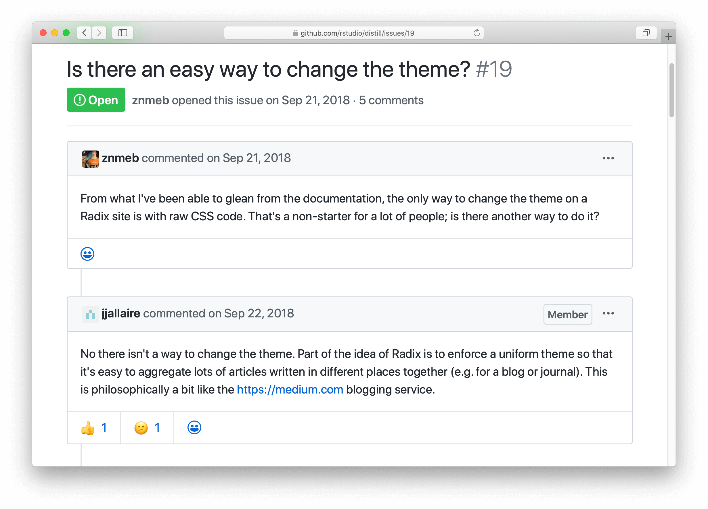

## The Problem

The [distill](https://rstudio.github.io/distill/) (formerly radix) package offers an excellent option in the R Markdown ecosystem to create beautifully typed websites. I was using it one day and looking into customizing the syntax highlighting theme. Then I found [this issue](https://github.com/rstudio/distill/issues/19):

I was a bit surprised and sad that there is no easy way to customize it. As a person with some opinions myself, I entirely respect the design choices, while I do hold some alternative views on two aspects of this.

First of all, I agree that the philosophy behind a software product is critical, and sometimes we have to balance the experience and flexibility one offers in the software. However, in reality, it is easy to use "experience" as an excuse for the lack of flexibility. For example, *enforcing* a unified theme within a website does not mean that one cannot *specify* that theme (or its details such as syntax highlighting) for their websites.

The second point is purely technical. If you look into the distill source code, it encodes all the syntax highlighting related CSS code (and others) in JavaScript (inst/www/distill/template.v2.js) and renders the styles with JS. This was done in a quite elegant but rather obscure way that makes simple CSS overrides challenging. Plus, CSS-in-JS does not seem to be a good engineering practice to me as it unnecessarily increases the developer's cognitive load.

## A solution

Since there is no formal extension mechanism for this part of distill and I'm not interested in deciphering the JS code, here comes a pure R solution. The following function finds and replaces the syntax highlighting CSS in the JS file from the installed distill package. You can choose or modify any custom CSS themes created for Prism.js, which are widely available and easily customizable.

This is a hot patch, meaning you can rebuild the websites and see the results immediately without restarting the R session or reloading the package. It is also a binary patch, meaning the patched package is prone to updates or reinstalls (the patched JS file is overridden). In case the patch didn't work, a simple reinstall of distill would restore things to normal. It is far from ideal, and I believe people can build more permanent solutions, such as creating an R package with renderers that allow such "extra customizations."
