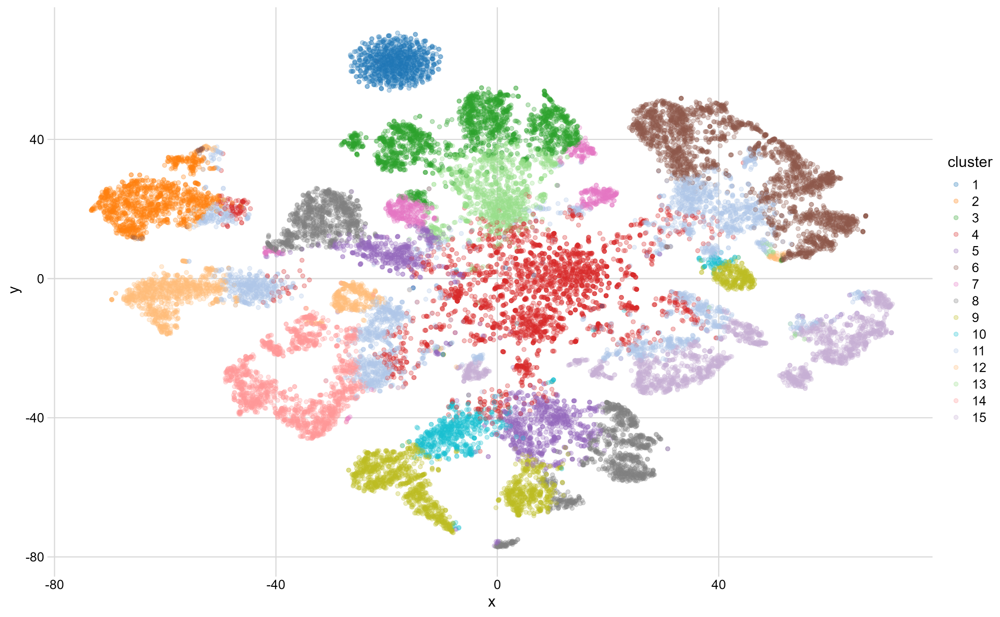

> The gene embedding training code is available from
> <https://github.com/nanxstats/exp2vec>.

> The Shiny app is at <https://nanx.shinyapps.io/exp2vec/>,
> with code available from
> <https://github.com/nanxstats/exp2vec-shiny>.

```{r, include=FALSE}
knitr::opts_chunk$set(
  comment = "#>",
  echo = TRUE,
  message = FALSE
)
```

.](/image/amy-shamblen-h5yMpgOI5nI-unsplash.jpg)

## Background

We can often observe a mysterious connection between natural languages and
the human genome when count data is derived from them. It is also
straightforward to model them using the latest statistical or
machine learning approaches developed for each field and
borrow ideas from each other.

For example, suppose we treat each gene as a "term" and say each sample is a
"document". In that case, we can use word embedding methods in NLP like
word2vec or GloVe to learn low-dimensional vector representations
for genes, given the gene expression count data for a collection of samples.

Traditional methods might assume two genes are similar if
they have highly correlated expression profiles or overlaps in labels.
In contrast, we assume that two genes are only similar if their
**expression context** is similar, i.e., the groups of genes that
frequently express together with them are similar.
This is not unlike the distributional hypothesis that words
occurring in similar contexts tend to have similar meanings.

Our approach would only require the expression data
without side information such as functional annotations.
It could also help us avoid
[common challenges](https://doi.org/10.3905/jpm.2004.110)
when measuring correlations between variables in a high-dimensional space.
We can then use the learned representations to measure the similarities
between genes, discover linear algebraic structure of genes,
and augment the input for downstream tasks.

## Preprocess GTEx data

The GTEx project uses RNA sequencing to characterize tissue-specific
gene expression patterns. First, I downloaded the open access read count data
from the [GTEx Portal](https://gtexportal.org/). The expression data is
encoded in gct (tsv) format, with metadata such as the tissue type
presented in a separate tsv file.

After a few basic data cleaning steps using my package [grex](https://nanx.me/grex/),
a count matrix is created focusing on the tissue _pancreas_. The data contains
328 samples and 25321 genes, with the expression count ranging from:

```r
quantile(dtm_tissue)
#>    0%      25%      50%      75%     100%
#>     0        1      107      939 11344034
```

## Convert DTM into TCM

The tricky part is getting a term-co-occurrence matrix (TCM)
from the document-term matrix (DTM) above because we need a TCM
as the input for gene embedding training.

We don't have the type of raw sequence data like a text corpus to
measure co-occurrence using sliding windows directly. Therefore, I took
a quick and dirty approach: convert document-term matrix $A$ to a
term co-occurrence matrix by the inner product $A^T A$ with corrections
for the diagonal self-cooccurrence. This is inspired by
[quanteda:::fcm.dfm()](https://github.com/quanteda/quanteda/blob/9a06c2b0256a6d260a1a2cc5a22ce088287d58da/R/fcm.R#L130).

```r
dtm2tcm <- function(x) {
  # Equivalent to t(x) %*% x
  y <- Matrix::crossprod(x)
  # Correct self-cooccurrence
  Matrix::diag(y) <- (Matrix::diag(y) - Matrix::colSums(x)) / 2L
  y
}
```

## Training GloVe model

My favorite [interpretation of word2vec](https://dl.acm.org/doi/10.5555/2969033.2969070)
or [GloVe](http://doi.org/10.1162/tacl_a_00134) is that they are inexplicitly
or explicitly factorizations of a word-context pointwise mutual information
(PMI) matrix with a shift. In our example, if we set the embedding
dimensionality to be 50, then it means factorizing the gene-context matrix
$M_{25321\times 25321}$ into a gene embedding matrix $G_{25321 \times 50}$ and
a context embedding matrix $C_{50 \times 25321}$ such that $M = G \cdot C$.
We then use $G$ to compute gene similarities and ruthlessly ignore $C$. 🤔

In my experiment, I used [text2vec](https://cran.r-project.org/package=text2vec)
to train a GloVe model, and set the embedding dimensionality as 100.
The other parameters: the maximum number of
co-occurrences used in the weighting function $x_{\max}$ = 100;
learning rate = 0.05; number of iterations = 50.
The embedding dimensionality is the key parameter here.
It can be tuned and often ranges from 50 to 300, increasing by 50.

On reproducibility, note that we can only
[get reproducible embeddings](https://github.com/dselivanov/text2vec/issues/251)
in text2vec by setting the random seed AND not using parallelization.
For training speed, I chose to use parallelization in this example.
Therefore, the embeddings we got is only reflecting one possibility.
More generally, the embedding stability between runs is an intriguing
[open problem](http://doi.org/10.18653/v1/N18-1190).

## Low-rank projection

After getting the gene embedding, I projected it onto a 2D plane using t-SNE
to see how well the embedding aligns with our perceived reality.
I also used k-means on the embedding to get 15 clusters and colorize the
projected points to make the patterns more distinguishable.



The dark blue cluster at the top-left corner looks unusual. So let's check
what genes are in it:

<details>
<summary>Click here to expand the list of genes in the cluster</summary>

```{css, echo=FALSE, eval=TRUE}
details > summary {
    border: 1px solid #6c757d;
    border-radius: 0.25rem;
    padding: 1rem;
}
```

```{r, echo=FALSE}
cat(readLines("cluster.txt"), sep = "\n")
```

</details>

<p></p>

The cluster contains mostly RNA genes, prefixed with LINC, MIR, RNA, SNOR, and TTTY. To a degree, this makes sense to me as genes involved in similar functions could
share similar expression contexts, thus considered similar.

## Gene neighbors

As a direct application of the gene embedding,
we can find the "most similar" genes for each gene
in terms of expression context. For example,
by querying four genes of interest (EGFR, TP53, PTEN, and KRAS), we get:

```{r, echo=FALSE}
read.table("nn.tsv", header = TRUE) |>
  knitr::kable(table.attr = "class=\"table table-hover\"", format = "html")
```

## Gene analogies

Another application of gene embedding is exploring the
linear algebraic structure of genes. For example, in word embeddings, we can ask:

<div style="text-align:center;">
<p>
`Berlin - Germany = [ ? ] - France`
</p>
</div>

where the word vectors would give us "Paris" as the answer.
As a random example, here we try to find the following tissue-specific
"gene analogies" with the gene embedding:

<div style="text-align:center;">
<p>
`BRCA1 - BRCA2 = [ ? ] - TP53`
</p>
</div>

**The motivation behind this question**:
BRCA1 and BRCA2 genes play a role in cancer by working together
in a common pathway of genome protection.
However, the two corresponding proteins work at different stages in
DNA damage response and DNA repair.
Faulty BRCA genes are associated with an increased risk of
developing breast, ovarian, and prostate cancer.
On the other side of the equation, TP53 is another well-known tumor
suppressor gene. By searching for a gene analogy to BRCA1 − BRCA2 for TP53,
we might find key genes that work in conjunction with TP53.

```r
gene_unknown <-
  word_vectors["BRCA1", , drop = FALSE] -
  word_vectors["BRCA2", , drop = FALSE] +
  word_vectors["TP53" , , drop = FALSE]
#>  UBE2O  LLGL2   SOX9   HID1   GGA3
#> 0.9427 0.9420 0.9412 0.9396 0.9390
```

Such capabilities could have potential applications in screening new leads for
mechanisms like synthetic lethality.

## Explore results interactively

Last but not least, I built a Shiny app:
<https://nanx.shinyapps.io/exp2vec/>.
You can use it to explore the gene neighbors and gene analogies.
