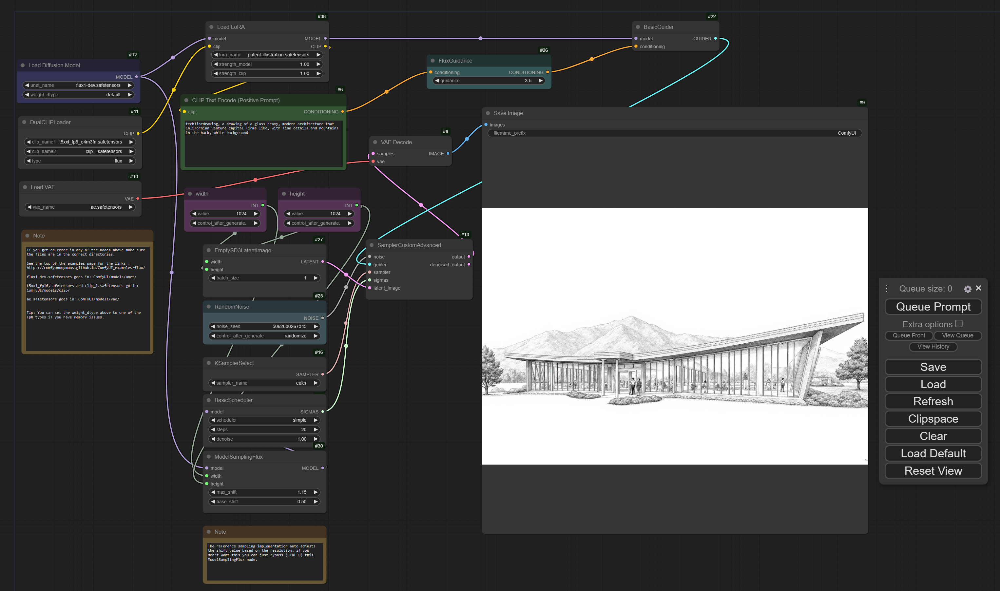

Besides playing the Elden Ring: Shadow of the Erdtree DLC and Black Myth: Wukong
on my gaming rig, I've also been playing with open weights generative AI models
lately. As always, I'm more than [impressed](https://nanx.me/blog/post/pkglite-llm-prompt/)
by the speed of innovation in this space.

For text generation models, at the moment (September 2024), I still feel the
output quality has a bit of a bottleneck on the type of foundation models
we can use and run with limited VRAM at an acceptable speed.
This may change any day in the future, though, so I'm turning my
attention to the latest image generation models.
Of course, I need to try Flux.1 from Black Forest Labs.

Theoretically, you only need to write a simple Python script to call
the Diffusers package to run the model. I still chose to use a web
GUI here because it's nice to have an automated, no-code solution
with a frontend for workflow construction and submitting prompts.

The results feel decent for the **minimal** number of things I tried.
You likely need to experiment with different random number seeds and different
prompts to get there, so it's important to have a good GPU or good patience.

## Technical setup guide

At the time of writing, the setup process to get things running is
not exactly apparent, so I will document it here.
This has been tested on a Windows PC with an RTX 4090 (24GB VRAM).

### Download web GUI software

There are many options, but I will use a simple one (ComfyUI) as an example.
It has a built-in Python with essential dependencies like PyTorch and Diffusers.
It might not be **security best practice** to blindly trust code and binaries
on the internet, but hey... make sure to do your own audit.
The workflow editor frontend is built with their fork of litegraph.js.

### Download models

1. Download `flux1-dev.safetensors` and `ae.safetensors` from
   [black-forest-labs/FLUX.1-dev](https://huggingface.co/black-forest-labs/FLUX.1-dev)
   on Hugging Face. There is also a commercial-friendly model
   [FLUX.1-schnell](https://huggingface.co/black-forest-labs/FLUX.1-schnell).
1. Download `t5xxl_fp8_e4m3fn.safetensors` and `clip_l.safetensors` from
   [comfyanonymous/flux_text_encoders](https://huggingface.co/comfyanonymous/flux_text_encoders/tree/main).
1. (Optional) Download your preferred LoRA model (`.safetensors`) from
   [FLUX.1-dev adapters](https://huggingface.co/models?other=base_model:adapter:black-forest-labs/FLUX.1-dev) for particular styles (there are 4,000+ of them).
   I used [jeremytai/techlinedrawing](https://huggingface.co/jeremytai/techlinedrawing)
   for the example image at the start of the post.

### Place models in the correct directory

1. `ComfyUI/models/unet/`: place `flux1-dev.safetensors`
1. `ComfyUI/models/vae/`: place `ae.safetensors`
1. `ComfyUI/models/clip/`: place `t5xxl_fp8_e4m3fn.safetensors` and `clip_l.safetensors`
1. `ComfyUI/models/loras/`: place your LoRA model's `.safetensors` file

### Run the foundation model

1. Run `run_nvidia_gpu.bat`
1. Drag the image on the [ComfyUI Flux examples](https://comfyanonymous.github.io/ComfyUI_examples/flux/) page into the ComfyUI page to import the Flux workflow.
1. Select the correct files in the interface:
   - Load Diffusion Model - unet_name: `flux1-dev.safetensors`
   - DualCLIPLoader - clip_name1: `t5xxl_fp8_e4m3fn.safetensors`, clip_name2: `clip_l.safetensors`
   - Load VAE - vae_name: `ae.safetensors`

Now, the workflow is ready to run. Click "Queue Prompt" to generate the example
image with the default prompt and seed. It took about 10 seconds on my machine.

### Add LoRA node to the workflow

1. Right-click on canvas, and select Add Node > loaders > Load LoRA.
1. In the new node, select lora_name as the LoRA model file name (`.safetensors`).
1. Insert the "Load LoRA" node between the "Load Diffusion Model" node and
   the "BasicGuider" node, to do this:
   - Connect the Load diffusion model node's `MODEL` output to the
     Load LoRA node's `model` input.
   - Connect the DualCLIPLoader node's `CLIP` output to the
     Load LoRA node's `clip` input.
   - Connect the Load LoRA node's `MODEL` output to the
     BasicGuider node's `model` input.
   - Connect the Load LoRA node's `CLIP` output to the
     CLIP Text Encode (Positive Prompt) node's `clip` input.

Write the prompt with the LoRA adapter's "trigger words". The words are often
listed in the `README.md` files of the LoRA repos.

Click "Queue Prompt" to generate images. If you click it many times, they
will be queued and generated sequentially. Besides displaying on the interface
once, all generated images will be stored in `ComfyUI/output`.

To exit, press Ctrl + C in the terminal and then press Y.

Now I've done it --- writing my first "open source AI" blog post! 🤗
