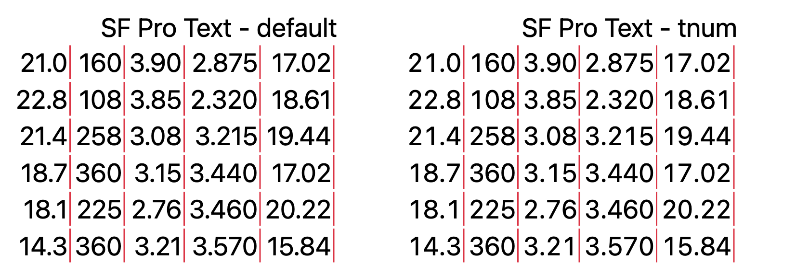
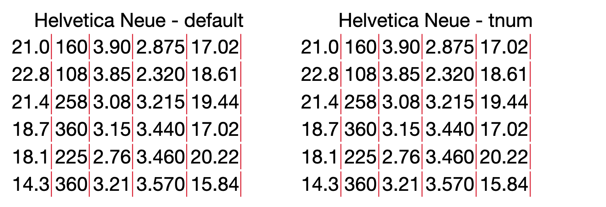
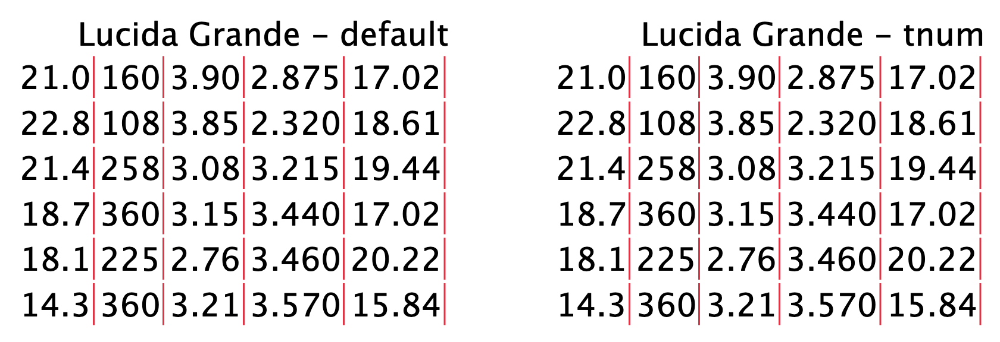
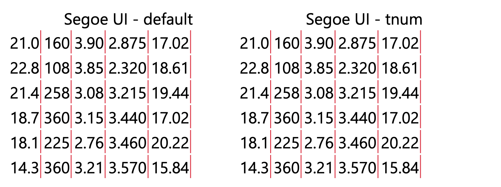
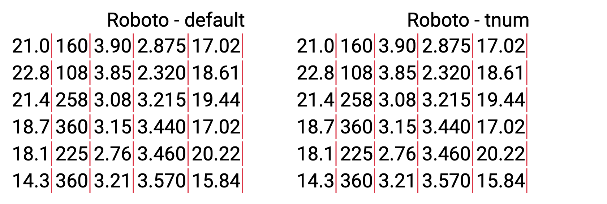
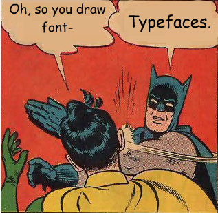

```{r, include=FALSE}
knitr::opts_chunk$set(
  comment = "#>",
  echo = TRUE,
  message = FALSE
)
```

> TL;DR: If you use the native font stack (the default
> in Bootstrap 4+), check the numbers displayed in tables,
> especially on Apple's platforms.

.](/image/jen-theodore-ONdBX-368ns-unsplash.jpg)

## A new problem

Many of the content creation frameworks that support HTML output
in the R world are getting upgraded to Bootstrap 4+:

- Shiny and R Markdown can [use bslib to customize Bootstrap version](https://rstudio.github.io/bslib/articles/bslib.html#versions);
- The [three-column Bootstrap style](https://bookdown.org/yihui/bookdown/html.html#bs4-book)
for bookdown projects;
- The [pkgdown 2.0.0 update](https://www.tidyverse.org/blog/2021/12/pkgdown-2-0-0/#bootstrap-5) introducing the Bootstrap 5 template;
- Quarto [HTML output](https://quarto.org/docs/output-formats/html-themes.html)
that is rendered with Bootstrap 5 by default.

After upgrading some of my applications and documents, the numbers in some
tables look weird under macOS: they are not 100% vertically aligned.

This issue is caused by the combination of two facts:

1. Bootstrap 4+ switched to the
[native font stack](https://getbootstrap.com/docs/5.1/content/reboot/#native-font-stack)
from the Helvetica/Arial font stack in Bootstrap 3.
2. The macOS default typeface
[San Francisco](https://en.wikipedia.org/wiki/San_Francisco_(sans-serif_typeface))
renders [proportional numbers](https://practicaltypography.com/alternate-figures.html#tabular-and-proportional-figures)
by default, although most of the other system default sans serif fonts
render tabular (fixed-width) numbers by default.

As you probably know,
[I like the native font stack](https://nanx.me/blog/post/the-return-of-the-native-font-stack/).
However, to present quantitative information effectively in tables, I would
expect the numbers on different rows are aligned vertically without using
monospaced typefaces.

## The subtle solution

There are around 20 CSS `font-*` properties controlling the typography.
You probably have used the four most common ones:
`font-family`, `font-weight`, `font-size`, and `font-style`.
Fortunately, there is a dedicated property
[`font-variant-numeric`](https://developer.mozilla.org/en-US/docs/Web/CSS/font-variant-numeric)
to specify the numeric glyphs if the corresponding
[OpenType features](https://developer.mozilla.org/en-US/docs/Web/CSS/CSS_Fonts/OpenType_fonts_guide)
are available.

For my use case, the solution is simple:

```css
table {
    font-variant-numeric: tabular-nums;
}
```

## A typesetting experiment

I wrote some
[R code](https://gist.github.com/nanxstats/617e03cddb7f3f4c04b73604c50ca842)
to create reproducible examples and demonstrate the fix.
The code generates specimens with knitr, htmltools, and
[webshot2](https://github.com/rstudio/webshot2).

Here are the results for the default typefaces under the mainstream platforms.
You can also observe their relative widths when rendered under the same size.
All table columns are right-aligned.

San Francisco for macOS:



Apple's previous defaults, Helvetica Neue and Lucida Grande:





Segoe UI for Windows:



Roboto for Android:



Oh, last but not least:



[Source](https://fuckyeahtypefacedesign.tumblr.com/post/42119630673/so-you-draw-fonts-anonymously-submitted).
