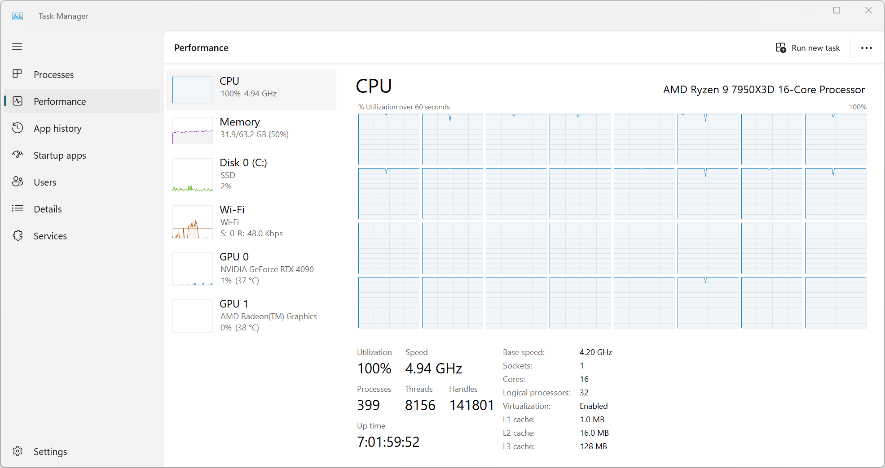

```{r, include=FALSE}
knitr::knit_hooks$set(pngquant = knitr::hook_pngquant)
knitr::opts_chunk$set(
  echo = FALSE,
  message = FALSE,
  collapse = TRUE,
  comment = "#>",
  dpi = 96,
  fig.retina = 2,
  fig.width = 10.6667,
  fig.height = 3.3334,
  fig.align = "center",
  out.width = "100%",
  pngquant = "--speed=1 --quality=50"
)
```

.](/image/elena-mozhvilo-7IvpEWgtmxw-unsplash.jpg)

I am excited to announce the release of [ggsci](https://nanx.me/ggsci/) 3.1.0.
ggsci is an R package that provides a collection of color palettes inspired
by colors used in scientific journals, data visualization libraries,
science fiction movies, and TV shows.

To install ggsci from CRAN, run:

```r
install.packages("ggsci")
```

This release introduces a new color scale and brings documentation improvements.
This post demonstrates how to create a Kaplan-Meier plot using ggsurvfit,
cowplot, and ggsci. We will also share a technical note on conducting
reverse dependency checks.

## New color palette and documentation improvements

ggsci 3.1.0 introduces a new color scale derived from the [BMJ living style
guide](https://technology.bmj.com/living-style-guide/colour.html),
contributed by [Hui Chen](https://github.com/huichen99).
The colors are ordered according to their real-world usage in published articles.

```{r}
#| fig-ggsci-bmj-color-palette,
#| fig.cap="Color palette added in ggsci 3.1.0.",
#| echo=FALSE,
#| dpi=300,
#| fig.width = 6,
#| fig.height = 3.2,
#| out.width = "100%",
color_palette <- ggsci::pal_bmj()(9)

plot(
  NULL,
  xlim = c(0, 10), ylim = c(0, 3),
  xlab = "", ylab = "",
  xaxt = "n", yaxt = "n",
  bty = "n"
)

for (i in 1:9) {
  rect(i - 1, 2, i, 3, col = color_palette[i], border = NA)
}

text(1:9 - 0.19, rep(1.8, 9), labels = color_palette, srt = 0, adj = 1, xpd = TRUE, cex = 0.3)
```

Here is how the new color scale looks when applied to ggplot2 plots:

```{r}
p1 <- ggplot2::ggplot(
  subset(ggplot2::diamonds, carat >= 2.2),
  ggplot2::aes(x = table, y = price, colour = cut)
) +
  ggplot2::geom_point(alpha = 0.7) +
  ggplot2::geom_smooth(method = "loess", alpha = 0.05, linewidth = 1, span = 1) +
  ggplot2::theme_bw()
p2 <- ggplot2::ggplot(
  subset(ggplot2::diamonds, carat > 2.2 & depth > 55 & depth < 70),
  ggplot2::aes(x = depth, fill = cut)
) +
  ggplot2::geom_histogram(colour = "black", binwidth = 1, position = "dodge") +
  ggplot2::theme_bw()
```

```{r}
#| fig-ggsci-bmj-color-scale,
#| fig.cap="Color scales applied to ggplot2 plots.",
p1 <- p1 + ggsci::scale_color_bmj()
p2 <- p2 + ggsci::scale_fill_bmj()
gridExtra::grid.arrange(p1, p2, ncol = 2)
```

As the number of color scales in ggsci grows, extending and maintaining the
documentation becomes challenging, mainly due to the tedious Rd syntax
(first written in 2016). To address this issue, I have converted the Rd syntax
to Markdown using [roxygen2md](https://roxygen2md.r-lib.org/) with minor manual
fixes. This change simplifies the documentation scaffolding and formatting,
making it easier for potential contributors to extend the list of color scales.

## Kaplan-Meier plot example

Having a standard ggplot2 implementation of Kaplan-Meier plots with
sufficient customization options and [sensible
defaults](https://nanx.me/blog/post/sensible-defaults/) has been a long-standing
dream for many researchers. As of 2024,
I feel [ggsurvfit](https://www.danieldsjoberg.com/ggsurvfit/) has emerged as a
powerful tool to fulfill this need.

Here is an example that demonstrates how to produce a publication-quality
Kaplan-Meier plot using ggsurvfit, cowplot, and ggsci with approximately
30 lines of R code, balancing function and aesthetics.
The dataset and analysis example are taken from the
[efficacy figure](https://r4csr.org/tlf-efficacy-km.html) chapter of the
[r4csr book](https://r4csr.org/).

```{r}
#| echo=TRUE
adtte <- haven::read_sas(
  paste0(
    "https://github.com/elong0527/r4csr",
    "/raw/main/data-adam/adtte.sas7bdat"
  )
)

adtte_ttde <- adtte |>
  dplyr::filter(PARAMCD == "TTDE") |>
  dplyr::select(TRTP, TRTAN, AVAL, CNSR) |>
  dplyr::mutate(
    TRTP = forcats::fct_reorder(TRTP, TRTAN),
    AVAL_m = AVAL / 30.4367
  )

fit <- survival::survfit(
  survival::Surv(AVAL_m, 1 - CNSR) ~ TRTP,
  data = adtte_ttde
)
```

With the fitted model, we can build the Kaplan-Meier plot,
add confidence intervals, risk tables, censor markings, quantiles,
and customize theming and color scales:

```{r}
#| fig-ggsci-ggsurvfit,
#| echo=TRUE,
#| fig.asp=0.8,
#| fig.cap="Kaplan-Meier plot produced by ggsurvfit, cowplot, and ggsci. _Look ma, no hands!_"
p <- fit |>
  ggsurvfit::ggsurvfit(linewidth = 1) +
  ggsurvfit::add_confidence_interval() +
  ggsurvfit::add_censor_mark(size = 2, alpha = 1) +
  ggsurvfit::add_quantile(
    y_value = 0.6,
    linewidth = 0.75,
    color = ggsci::pal_bmj(alpha = 1)(9)[9]
  ) +
  ggsurvfit::add_risktable(
    size = 5,
    theme = list(
      ggsurvfit::theme_risktable_default(
        axis.text.y.size = 14,
        plot.title.size = 14
      ),
      ggplot2::theme(plot.title = ggplot2::element_text(face = "bold"))
    )
  ) +
  ggsurvfit::add_risktable_strata_symbol(symbol = "\U25CF", size = 18) +
  ggsurvfit::scale_ggsurvfit() +
  ggplot2::labs(
    title = paste(
      "Kaplan-Meier Plot for",
      "Time to First Dermatologic Event by Treatment Group"
    ),
    subtitle = "All Participants"
  ) +
  cowplot::theme_cowplot(rel_large = 15 / 14, rel_small = 14 / 14) +
  ggplot2::theme(legend.position = "bottom") +
  ggsci::scale_color_bmj() +
  ggsci::scale_fill_bmj()

p
```

While there is not a one-size-fits-all color solution for all visualization needs,
the flexibility of the ggplot2 scale system allows you to easily switch to any
other discrete [color scales in ggsci](https://nanx.me/ggsci/reference/)
to suit your specific preferences.

## Reverse dependency checks

As the number of reverse dependencies of ggsci grows, it is increasingly
important to run proper reverse dependency checks before making new releases.
The _R Packages_ book has [a dedicated section](https://r-pkgs.org/release.html#sec-release-revdep-checks) covering this topic.

Reverse dependency checking is a computationally intensive and naturally parallel task.
High CPU core count machines, such as certain extra large instance types
from public cloud platforms, can significantly reduce the run time.
For smaller-scale reverse dependency checking needs like mine,
a mainstream local desktop setup may be sufficient.
Here is an example of running revdepcheck for ggsci using my gaming rig.
Documenting my workflow can be helpful, as there might be some minor
rough edges when setting up the running environment, even though the
revdepcheck package has solved the main problem.

First, install revdepcheck:

```r
remotes::install_github("r-lib/revdepcheck")
```

Launch R from the terminal for stability and avoid using GUIs in such cases.

```r
git clone https://github.com/nanxstats/ggsci.git
cd ggsci
R -q
```

Optionally, set the CRAN and Bioconductor mirror explicitly.
These settings may not be necessary but are listed as a
preemptive measure in case the default values inherited don't work.

```r
options(repos = "https://cloud.r-project.org/")
utils::chooseBioCmirror()
```

If you customized `R_LIBS_USER` in `.Renviron` to set a special personal library
path, and it is not loaded in this context, leading to "package not found" errors,
temporarily prepend the path to `.libPath()` for this R session.

```
.libPaths(c("/CUSTOM/LIBRARY/PATH", .libPaths()))
```

Now, run revdepcheck:

```r
revdepcheck::revdep_check(num_workers = 32)
```

If your CPU is maxed out at 100% utilization, you've done it right.
Under Linux, you can monitor this with the command line tool `htop`.
Here is a Windows Task Manager screenshot:

```{r}
#| fig.cap="Running revdepcheck with 32 parallel workers on Ryzen 7950X3D (16 cores, 32 threads)."

```

Checking all 36 reverse dependencies finished in 16 minutes.

```{r}
#| fig.cap="Reverse dependency check progress and summary. Font: Iosevka Term."
knitr::include_graphics("images/revdepcheck-cli.png")
```
