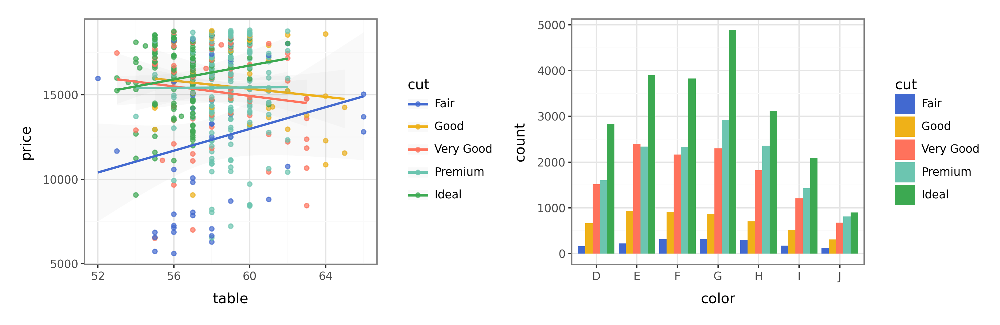

.
](/image/art-institute-of-chicago-fja2UYOT6jg-unsplash.jpg)

I'm thrilled to announce the release of [py-ggsci](https://nanx.me/py-ggsci/),
a Python package that brings the popular ggsci color palettes
from R's ggplot2 ecosystem to Python's plotnine library.

You can install py-ggsci from PyPI:

```bash
pip install ggsci
```

Here is a quick example using the Observable 10 palette introduced
in [ggsci 3.2.0](https://nanx.me/blog/post/ggsci-3-2-0/):

```python
from plotnine import *
from plotnine.data import diamonds

from ggsci import *

p1 = (
    ggplot(diamonds.query("carat >= 2.2"), aes("table", "price", color="cut"))
    + geom_point(alpha=0.7)
    + geom_smooth(method="lm", alpha=0.05, size=1)
    + theme_bw()
)

p2 = (
    ggplot(diamonds, aes("color", fill="cut"))
    + geom_bar(position=position_dodge())
    + theme_bw()
)

(p1 + scale_color_observable()) | (p2 + scale_fill_observable())
```

```{r, echo=FALSE, out.width="100%", fig.align="center"}

```

For clarity, we will refer to the R package as r-ggsci and the Python package
as py-ggsci throughout this post.

## The story behind r-ggsci

It all started in the Spring of 2016. I was a PhD student drowning in
homework and exams in a quarter system. Although R Markdown + knitr
already saved me tremendous amount of time in writing reports by avoiding
the tedious LaTeX syntax and allowing embedding code execution results,
I still found myself spending too much time tweaking colors in my ggplot2
plots to make them look presentable.

I wanted a fast way (Breimanesque terminology: off-the-shelf) to apply
color palettes that were already well-designed under different plotting contexts.
That was when I decided to create an R package that provides such color palettes
for ggplot2, which later became [r-ggsci](https://nanx.me/ggsci/).
The response greatly exceeded my expectations.

Ten years later, r-ggsci has been widely used in the R community for
creating publication-quality data visualizations with millions of downloads
per year and ranks in the top 1% by installations of all packages on CRAN.

## Why py-ggsci?

Recently, two friends of mine [@svm-zhang](https://github.com/svm-zhang) and
[@elong0527](https://github.com/elong0527) both asked about using plotnine
in Python or if they could use ggsci palettes with plotnine.
To me, this was a sign to act. Thanks to the clean, consistent APIs of
plotnine and mizani, py-ggsci went from concept to this release announcement
in only 72 hours.

## Porting palettes from R to Python

While the API was straightforward to port, the main challenge was automating
the conversion of
[palette data](https://github.com/nanxstats/ggsci/blob/master/R/palettes.R)
from R to Python. I wanted a solution that would avoid manual copy-pasting
and simplify future updates.
The trick was to evaluate the R code to get the palette data object,
then export it as JSON. Leveraging the remarkable similarity between
the JSON syntax and Python dictionary syntax, the JSON tokens work directly as
Python code without modification.
This approach converted the palette data from r-ggsci in [just a few lines of R code
](https://github.com/nanxstats/py-ggsci/blob/main/scripts/update_palettes_data.R).

Since there is not a standard vignette system in Python like R (and my
reluctance to involve heavyweight frameworks like Jupyter or Quarto), most of my time was
spent on recreating the [main vignette](https://nanx.me/py-ggsci/articles/get-started/)
using [markdown-exec](https://github.com/nanxstats/py-ggsci/pull/11).
Eventually, it all worked out.

## Future plans

Maintaining parallel implementations in two programming languages does
create some overhead, but I'm committed to supporting both r-ggsci and
py-ggsci in the long term.
New color scales will continue to be added, with r-ggsci receiving version
updates first, followed by synchronized updates to py-ggsci.

Whether working natively in R or Python, you now have access to the same
color palettes that have made countless visualizations publication-ready.
Happy plotting!
