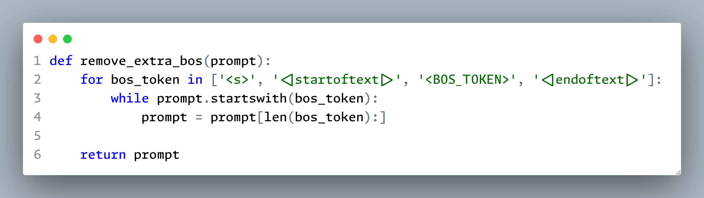

.](/image/florian-klauer--K6JMRMj4x4-unsplash.jpg)

The token **<|endoftext|>** is a special token used as a document separator
for OpenAI GPT models. It has become quite prevalent if you look closely:

- It has been used since [GPT-2](https://huggingface.co/docs/transformers/model_doc/gpt2)
  and remains present in the OpenAI API for their latest models.
  Their tokenizer package, tiktoken, includes logic to process text with these
  [special tokens](https://github.com/openai/tiktoken/blob/c0ba74c238d18b4824c25f3c27fc8698055b9a76/tiktoken_ext/openai_public.py#L3-L7).
- The markup **<|** and **|>** is widely used in the code bases of LangChain
  and text-generation-webui. It usually serves as a lightweight templating
  syntax to mark particular text sections for replacement.
- Improper handling of this special token has led to [interesting
  results](https://www.lesswrong.com/posts/HvmhZR6EJEi7bEqBh/less-than-or-endoftext-or-greater-than-is-a-vanishing-text)
  in chatbot interfaces.

The use of **<|** and **|>** might seem random. My theory is that people who
introduced this convention use a coding font with programming ligatures.
As shown in the figures below, it makes more visual sense with
the ligatures enabled, as the cognitive load is greatly reduced when
distinguishing them. I find my brain finally starting to understand what
the code is trying to say.

```{r}
#| echo=FALSE,
#| out.width="100%",
#| fig.cap="Code snippet from text-generation-webui, ligatures off."

```

```{r}
#| echo=FALSE,
#| out.width="100%",
#| fig.cap="Code snippet from text-generation-webui, ligatures on."

```

Now, here are five popular typefaces with original ligature designs
that I often use as my main coding font, displayed in regular weight (400).
You can find many more alternatives in the
[ToxicFrog/Ligaturizer](https://github.com/ToxicFrog/Ligaturizer)
repository, where regular monospaced fonts are patched with Fira Code ligatures.

```{css, echo=FALSE}
@font-face {
    font-display: swap;
    font-family: "Cascadia Code Regular";
    src: url("fonts/CascadiaCode-Regular.woff2") format("woff2");
    font-weight: 400;
}

@font-face {
    font-display: swap;
    font-family: "Fira Code Regular";
    src: url("fonts/FiraCode-Regular.woff2") format("woff2");
    font-weight: 400;
}

@font-face {
    font-display: swap;
    font-family: "Hasklig Regular";
    src: url("fonts/Hasklig-Regular.woff2") format("woff2");
    font-weight: 400;
}

@font-face {
    font-display: swap;
    font-family: "JetBrains Mono Regular";
    src: url("fonts/JetBrainsMono-Regular.woff2") format("woff2");
    font-weight: 400;
}

@font-face {
    font-display: swap;
    font-family: "Monaspace Argon Regular";
    src: url("fonts/MonaspaceArgon-Regular.woff2") format("woff2");
    font-weight: 400;
}

.font-cascadia-code pre code {
    font-family: "Cascadia Code Regular" !important;
    font-feature-settings: normal !important;
}
.font-fira-code pre code {
    font-family: "Fira Code Regular" !important;
    font-feature-settings: normal !important;
}
.font-hasklig pre code {
    font-family: "Hasklig Regular" !important;
    font-feature-settings: normal !important;
}
.font-jetbrains-mono pre code {
    font-family: "JetBrains Mono Regular" !important;
    font-feature-settings: normal !important;
}
.font-monaspace-argon pre code {
    font-family: "Monaspace Argon Regular" !important;
    font-feature-settings: "ss01", "ss02", "ss03", "ss05", "ss07", "ss09" !important;
}
```

## Cascadia Code

<div class="font-cascadia-code">

```python
ENDOFTEXT = "<|endoftext|>"
FIM_PREFIX = "<|fim_prefix|>"
FIM_MIDDLE = "<|fim_middle|>"
FIM_SUFFIX = "<|fim_suffix|>"
ENDOFPROMPT = "<|endofprompt|>"
## :: := => <- -> == != <= >= ++ || &&
```

</div>

## Fira Code

<div class="font-fira-code">

```python
ENDOFTEXT = "<|endoftext|>"
FIM_PREFIX = "<|fim_prefix|>"
FIM_MIDDLE = "<|fim_middle|>"
FIM_SUFFIX = "<|fim_suffix|>"
ENDOFPROMPT = "<|endofprompt|>"
## :: := => <- -> == != <= >= ++ || &&
```

</div>

## Hasklig

<div class="font-hasklig">

```python
ENDOFTEXT = "<|endoftext|>"
FIM_PREFIX = "<|fim_prefix|>"
FIM_MIDDLE = "<|fim_middle|>"
FIM_SUFFIX = "<|fim_suffix|>"
ENDOFPROMPT = "<|endofprompt|>"
## :: := => <- -> == != <= >= ++ || &&
```

</div>

## JetBrains Mono

<div class="font-jetbrains-mono">

```python
ENDOFTEXT = "<|endoftext|>"
FIM_PREFIX = "<|fim_prefix|>"
FIM_MIDDLE = "<|fim_middle|>"
FIM_SUFFIX = "<|fim_suffix|>"
ENDOFPROMPT = "<|endofprompt|>"
## :: := => <- -> == != <= >= ++ || &&
```

</div>

## Monaspace Argon

<div class="font-monaspace-argon">

```python
ENDOFTEXT = "<|endoftext|>"
FIM_PREFIX = "<|fim_prefix|>"
FIM_MIDDLE = "<|fim_middle|>"
FIM_SUFFIX = "<|fim_suffix|>"
ENDOFPROMPT = "<|endofprompt|>"
## :: := => <- -> == != <= >= ++ || &&
```

</div>

Of course, this post should end with a proper...

`<|endoftext|>`
