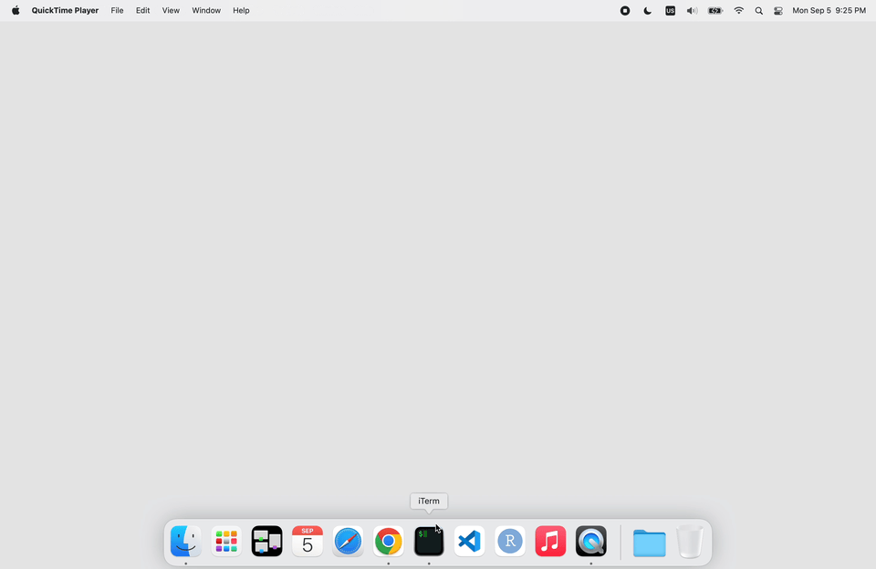

```{r, include=FALSE}
knitr::opts_chunk$set(
  comment = "#>",
  message = FALSE,
  eval = FALSE
)
```

> The code in this post is also available in
> this [GitHub Gist](https://gist.github.com/nanxstats/2e307097b7dd0171bcfae2be8edebdfd).

> Disclaimer: the tools and configurations mentioned in this post are only
> discussed as technical examples; they do not constitute an endorsement.
> Use at your own risk.

.](/image/martin-reisch-1b3Ix12HlkM-unsplash.jpg)

Today's internet is not like it was 20 years ago for an older millennial like me.
Only judging by its appearance, the internet today is plagued with
cookie consent popups and paywalls. Well, maybe they exist for good
(commercial) reasons, but I constantly feel that they are designed
to be intrusive and break my reading flow. To me, that is counterproductive.

I find the "Annoyances" filters under the uBlock Origin filters list adequate
to block cookie notices. However, for paywalls, we need something more
specifically built. One possibility is the
bypass-paywalls-chrome-clean
extension. For reasons explained in its repo, such extensions are not allowed
on the Chrome web store, so it needs to be installed and updated manually
under developer mode on the extensions page.

## The task

The general steps to update the extension are:

1. Open the extensions page in the browser.
1. Click the "Remove" button to remove the old version.
1. Click the "Remove" button in the popup dialog to confirm.
1. Open the terminal, and pull the latest version from the Git repository.
1. Drag and drop the updated extension directory into the extensions page.
1. Close the opened browser tabs and terminal.

Since these steps are repetitive and there is no obvious CLI or API
available for the actions involved, I find it a good exercise for GUI automation.
I choose [RobotJS](https://www.npmjs.com/package/robotjs) to implement it
and will run the automation script using Node.js,
although there seem to be more modern JavaScript libraries for GUI automation,
for example, [nut.js](https://www.npmjs.com/package/@nut-tree/nut-js).

I have not tested the cross-platform compatibility of such libraries
besides running on macOS. Conceptually, the workflow can be easily
ported to more desktop environments.

## Automate with RobotJS

My implementation looks like this:

```{js}
const robot = require("robotjs");
const { execSync } = require("child_process");

const updateExtension = (coordRemove) => {
  // Open in extensions page in browser
  execSync('open -a "Google Chrome" chrome://extensions');

  // Move to and click "Remove" button of the extension
  robot.setMouseDelay(1000);
  robot.moveMouseSmooth(coordRemove[0], coordRemove[1]);
  robot.mouseClick();

  // Click "Remove" button in the confirm dialog
  robot.keyTap("enter");

  // Open iTerm (new tab) and do git pull
  execSync("open -a iTerm .");
  robot.typeStringDelayed("cd bpc && git pull", 800);
  robot.keyTap("enter");

  // Open Finder and highlight the directory
  execSync("open -a Finder");
  robot.typeStringDelayed("bpc", 1000);

  // Get selected directory position by its highlighted color
  let screen = robot.getScreenSize();
  let img = robot.screen.capture(0, 0, screen.width, screen.height);

  // Support for higher density screens
  let multiplier = img.width / screen.width;

  // Find the x coordinate: likely covers the center of the screen
  let coordFinderX = screen.width / 2;

  // Find the y coordinate
  let colors = [];
  for (let i = 0; i < screen.height; i++) {
    colors[i] = img.colorAt(coordFinderX * multiplier, i * multiplier);
  }

  let bluepixel = colors.indexOf("2961d9");
  robot.moveMouseSmooth(coordFinderX, bluepixel + 10);
  robot.mouseToggle("down");

  // Drag and drop into extensions tab
  robot.dragMouse(30, bluepixel + 50);
  setTimeout(() => {
    robot.mouseToggle("up");
  }, 500);

  // Close the popup options tabs, extension tab, Finder, and iTerm tabs
  setTimeout(() => {
    robot.keyTap("w", "command");
  }, 5000);

  setTimeout(() => {
    robot.keyTap("w", "command");
  }, 6000);

  setTimeout(() => {
    robot.keyTap("w", "command");
  }, 7000);

  setTimeout(() => {
    execSync("open -a Finder");
    robot.keyTap("w", "command");
  }, 8000);

  setTimeout(() => {
    execSync("open -a iTerm");
    robot.keyTap("w", "command");
    robot.keyTap("w", "command");
  }, 9000);
};
```

After finding the coordinates of the "Remove" button after trial and error,
plug it into the function call. Perhaps this step can also be automated,
but I find it better to keep the code simple.

```{js}
updateExtension([235, 425]);
```

We can then save the lines above in a `.js` file and run it with `node`:



## Notes

Not surprisingly, the automation has a few essential prerequisites and assumptions.
The important ones are:

1. NodeJS and RobotJS are installed.
1. On the extensions page, Developer Mode is switched on.
1. The extension Git repo is cloned to a local directory.
1. The extension is already installed.
1. You are using the List view in Finder and using the default blue accent
   color to correctly locate the folder when highlighted.
1. iTerm will require permissions when running this for the first time
   to control the mouse/keyboard and take screenshots.
   It will involve enabling iTerm in two categories, "Accessibility" and
   "Screen Recording", under System Preferences → Security & Privacy → Privacy.
