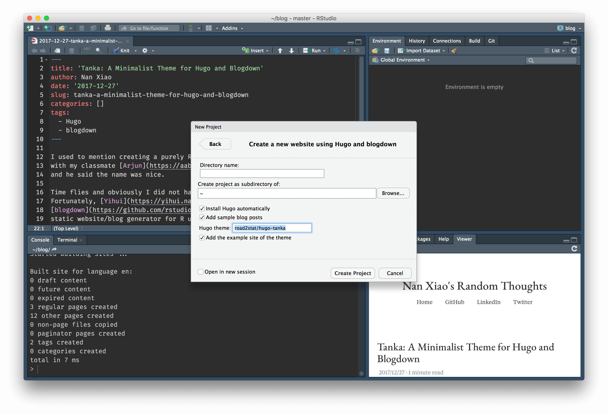

I used to mention creating a purely R-based static website generator named Haiku
with my then classmate [Arjun](https://aabiddanda.github.io/) about two years ago.
I remember that he said the name was nice.

Time flies, and apparently, I did not have the chance to build it.
Fortunately, [Yihui](https://yihui.org/) saved the world again, and now
[blogdown](https://github.com/rstudio/blogdown) has become the most elegant
and powerful static website generator for R users,
especially if you love R Markdown.

Without a hesitation, I decided to revive my blog and build a minimalist theme for it.
Based on David's awesome [Black & Light](https://github.com/davidhampgonsalves/hugo-black-and-light-theme) theme,
I made some of my own improvements and built this Hugo theme named
[Tanka](https://github.com/nanxstats/hugo-tanka) for blogdown and Hugo users.

It is straightforward to create your blogdown website and try out the
Tanka theme in RStudio. Simply click `File` → `New Project` →
`New Directory` → `Website using blogdown`, then fill the "Hugo theme"
field with `nanxstats/hugo-tanka`.

Let me know if you have any questions or suggestions for this theme. Enjoy!
