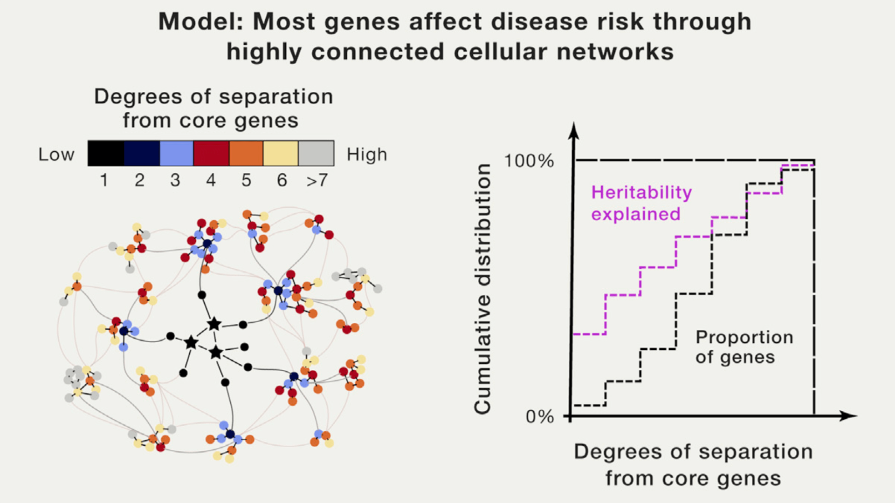

It is the last day of 2017. Looking back, it has been another fruitful year for statistical and machine intelligence research. Notably, a lot of new ideas have been published in the direction of deep learning. Although it is intriguing, I will probably talk about things I care about in deep learning in another post. Fingers crossed.

Today I just want to write about two impressive papers that influenced me in the year 2017. The reason why I recommend them is simple: I think they are both seminal or at least super creative work that made substantial intellectual contributions to their fields.

## 1. The omnigenic model

Boyle, Evan A., Yang I. Li, and Jonathan K. Pritchard. [An expanded view of complex traits: from polygenic to omnigenic](https://doi.org/10.1016/j.cell.2017.05.038). _Cell_ 169.7 (2017): 1177-1186.

This paper attracted a lot of discussions on social media. The hypothesis is straightforward: complex traits are affected by a few "core genes" and many highly interconnected "networks of genes" together. For me, this idea is intuitive and offers an almost direct explanation for unsolved issues like missing heritability. It pointed out a promising direction and infinite possibilities for follow-up research. The obvious question is, how to quantitatively model this idea in a way that is statistically or mathematically feasible.

For people who work in statistics, this probably means your regression model will not be necessarily sparse, and that could be a technical challenge for modeling high-dimensional data. At least, more subtlety or "levels" in your regularization is probably desired: beyond a few core true variables with large effect sizes, many more true variables can be highly-correlated, can be somehow clustered, or can be from networks of variables.

Properties like grouping effect in [elastic-net](https://web.stanford.edu/~hastie/Papers/B67.2%20(2005)%20301-320%20Zou%20&%20Hastie.pdf) can be handy. Empirical Bayes shrinkage estimation methods, such as Matthew's [adaptive shrinkage](https://doi.org/10.1093/biostatistics/kxw041) could be more effective in capturing such subtle signals in the data. Ideas like [homogeneity pursuit](http://zke.fas.harvard.edu/papers/Homogeneity.pdf) for selecting clusters of variables, and our [ordered homogeneity pursuit lasso](https://ohpl.io/) approach for selecting intervals of spatially correlated variables in spectroscopic data, are also worth looking.

Anyway, please remember that 2017 is Year One for the omnigenic model.

## 2. Same stats, different graphs

Matejka, Justin, and George Fitzmaurice. [Same stats, different graphs: Generating datasets with varied appearance and identical statistics through simulated annealing](https://www.autodesk.com/research/publications/same-stats-different-graphs). _Proceedings of the 2017 CHI Conference on Human Factors in Computing Systems_. ACM, 2017.

This is a fascinating work done by people from Autodesk Research. In fact, it is a generalization of [Anscombe's quartet](https://en.wikipedia.org/wiki/Anscombe%27s_quartet) that are known to statisticians. As is indicated in its title, this paper successfully formulated the problem of generating visually dissimilar datasets with identical summary statistics as an optimization problem.

To me, this sounds like a cool reverse engineering of human visual perception under tight constraints. Compared to the limited four special cases in Anscombe's quartet, it is more like a hardcore constructive proof for a theorem.

Similar to Omar Wagih's [Guess the Correlation](http://guessthecorrelation.com/) game, this paper showed the importance of visualizing your data. It also demonstrated that a visualization alone or some summary statistics alone might not be enough for fully understanding your data --- it is better to combine the analytical and visual approaches.

OK, so much for this year. Happy 2018!
