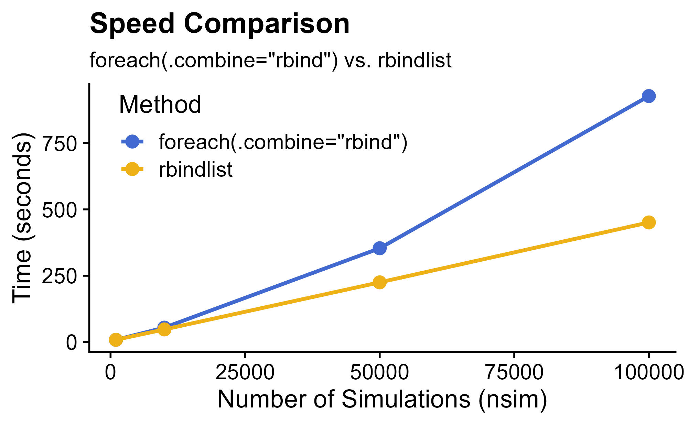

![Cute boat in a glass bottle.
Art generated by FLUX.1 [dev] +
[cozy-book-800 LoRA adapter](https://huggingface.co/fffiloni/cozy-book-800).
](/image/cute-boat-in-a-glass-bottle.png)

::: {.callout}
The benchmarking script used in this post is available as a
[GitHub gist](https://gist.github.com/nanxstats/07442aba90a5bc2f4b7d821338f9eede).
:::

```{css, echo=FALSE}
.callout p {
  font-weight: 400;
  font-size: 1rem;
  letter-spacing: var(--bdo-ls-tiny);
  margin-top: 1.25rem;
  margin-bottom: 1.25rem;
  padding-top: 1.25rem;
  padding-bottom: 1.25rem;
  padding-left: 1rem;
  padding-right: 1rem;
  border-radius: 0.25rem;
  border-left: 5px solid #64748b;
  border-right: 1px solid #cbd5e1;
  border-top: 1px solid #cbd5e1;
  border-bottom: 1px solid #cbd5e1;
}
```

This post recommends avoiding the use of `foreach(.combine = "rbind")`
in parallel loops in R. Instead, manually combine the results after the
`foreach()` call using functions like
`data.table::rbindlist()` or `dplyr::bind_rows()`.

## Performance issues with rbind()

The `do.call(rbind, list)` pattern in R is an expressive and functional way
to bind data frames from a list into a single data frame. Meanwhile, your
code could also take a [potential performance hit](https://rpubs.com/jimhester/rbind)
as the list size gets large.
The convinient argument `.combine` in `foreach()` could have
similar performance traps. This means by using `.combine = "rbind"`,
the parallel `foreach()` call can have significantly degraded performance
as the number of iterations increases.

## Benchmarking setup

To quantify this issue, I created a simple benchmark comparing two approaches:

- **Method 1:** `foreach(.combine = "rbind")`
- **Method 2:** `foreach()` without `.combine`, followed by `data.table::rbindlist()`

First, I created a CPU-intensive function that performs singular value decomposition
(SVD) on 300 randomly generated 10x10 positive semidefinite matrices.
The function returns a 300x7 data frame summarizing the results:

```{r, eval=FALSE}
anysvd <- function(id, dim = 10, nrep = 300) {
  results <- vector("list", nrep)

  for (j in 1:nrep) {
    X <- matrix(rnorm(dim^2), dim, dim)
    A <- crossprod(X)

    s <- svd(A)

    results[[j]] <- data.frame(
      id = id,
      sub_id = j,
      sv1 = s$d[1],
      sv2 = s$d[2],
      sv3 = s$d[3],
      matrix_norm = norm(A, type = "F"),
      matrix_trace = sum(diag(A))
    )
  }

  as.data.frame(data.table::rbindlist(results))
}
```

I ran the benchmarks across different numbers of iterations (1000, 10000, 50000, 100000)
using the `%dofuture%` operator on a 32-worker setup (7950X3D):

```{r, eval=FALSE}
library(doFuture)

plan(multisession, workers = 32)

nsim_grid <- c(1000, 10000, 50000, 100000)

df_bench <- data.frame(
  nsim = integer(),
  method = character(),
  time = numeric()
)

for (nsim in nsim_grid) {
  message("Running benchmark with nsim=", nsim)

  # Method 1: foreach(.combine = "rbind")
  set.seed(42)
  tictoc::tic.clearlog()
  tictoc::tic(paste0("method1_nsim", nsim))
  df_rbind <- foreach(
    i = 1:nsim,
    .combine = "rbind",
    .options.future = list(seed = TRUE)
  ) %dofuture% {
    anysvd(i)
  }
  tictoc::toc(log = TRUE, quiet = TRUE)

  # Method 2: foreach then rbindlist
  set.seed(42)
  tictoc::tic(paste0("method2_nsim", nsim))
  lst_rbindlist <- foreach(
    i = 1:nsim,
    .options.future = list(seed = TRUE)
  ) %dofuture% {
    anysvd(i)
  }
  df_rbindlist <- as.data.frame(data.table::rbindlist(lst_rbindlist))
  tictoc::toc(log = TRUE, quiet = TRUE)

  if (!identical(df_rbind, df_rbindlist)) warning("Discrepant results for nsim=", nsim)

  lst_log <- tictoc::tic.log(format = FALSE)
  df_bench <- rbind(
    df_bench,
    data.frame(
      nsim = nsim,
      method = "foreach(.combine=\"rbind\")",
      time = lst_log[[1]]$toc - lst_log[[1]]$tic
    ),
    data.frame(
      nsim = nsim,
      method = "rbindlist",
      time = lst_log[[2]]$toc - lst_log[[2]]$tic
    ),
    make.row.names = FALSE
  )

  tictoc::tic.clearlog()
}
```

## Benchmark results

The results in the figure demonstrate that while both methods perform similarly
at smaller scales (1000 iterations). The `.combine = "rbind"` method quickly
becomes inefficient as the number of iterations increase, while the
manual combine method sees linear time growth.



The table below shows the original timing numbers.
At least for this particular benchmark, we see that at higher iteration counts
(10000+), combining results with `.combine` dramatically increases execution time.
Specifically, at 100000 iterations, using `.combine = "rbind"` approximately
doubles the total execution time compared to manually combining with `rbindlist()`
--- from CPU monitoring, half of the time was spent on burning one CPU core.

```{css, echo=FALSE}
.table {
  font-variant-numeric: tabular-nums;
  font-size: 1rem;
}
```

```{r, echo=FALSE}
options(scipen = 999)
read.table("foreach-rbind-benchmark.tsv", header = TRUE, sep = "\t", check.names = FALSE, quote = "") |>
  knitr::kable(table.attr = "class=\"table table-hover table-sm\"", format = "html", align = c("l", "l", "l"))
options(scipen = 0)
```

<p></p>

## Conclusion

Based on this benchmark, you should consider avoiding `.combine = "rbind"`
in parallel `foreach()` loops. Instead, aggregate the results after parallel
execution using more efficient alternatives such as `data.table::rbindlist()` or
`dplyr::bind_rows()`. Further investigation into the other methods supported by
`.combine` is recommended to fully understand their performance implications.
