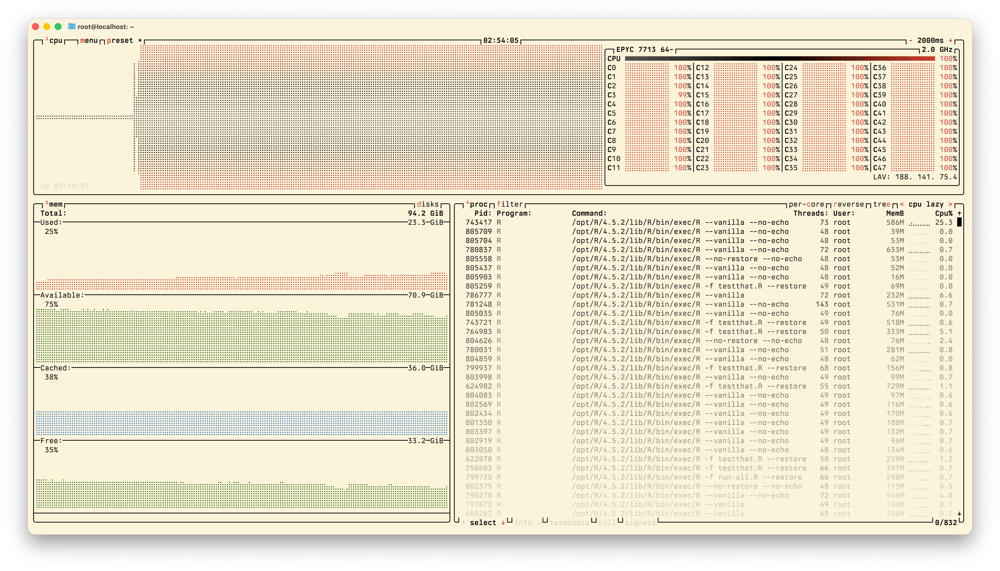
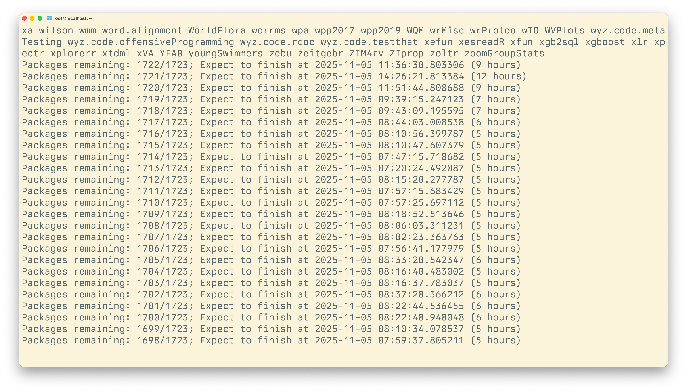
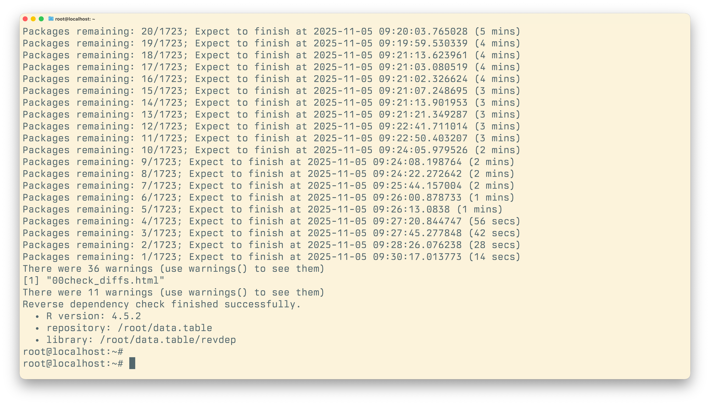

.
](/image/elvis-liang-dKI9xpL8l-k-unsplash.jpg)

A week ago, I [announced revdeprun](https://nanx.me/blog/post/revdeprun/),
a Rust CLI tool for automating R package reverse dependency checks.
Since then, I have been iterating rapidly: 16 crates.io releases in a week!
These updates focused on both correctness and speed.
The tool has evolved from its initial v0.1.0 to v1.4.2,
and the workflow now leverages pak for dependency resolution
and xfun for the checking[^1].

[^1]: I learned a lot from studying revdepcheck and revdepcheck.extras while
building this. I even got to [contribute a bug fix](https://github.com/yihui/xfun/pull/109)
to the amazing xfun along the way.

Through this process, I improved my understanding of R's build system and
developer tooling. I also gained confidence that revdeprun can handle packages
with long lists of reverse dependencies reliably. But I wanted to really put
it to the test.

## Speedrunning revdep checks?

Since there are [GPT-2 speedruns](https://www.tylerromero.com/posts/nanogpt-speedrun-worklog/),
why not revdep check speedruns? Here's my working definition:

> Given a cloud instance running fresh Ubuntu LTS, how fast can you set up the
> environment and run reverse dependency checks *correctly* for a CRAN package
> with hundreds or thousands of reverse dependencies?

This is essentially a performance test for CPU, network, and I/O, but mostly
CPU. For packages with more reverse dependencies, you will spend most of the
time in the parallel checking phase, using every core you can afford.
A server CPU with strong multi-core performance and decent single-core
performance will serve you well.

Of course, the baseline shifts over time. As your package gets more popular,
there will be more reverse dependencies to check. Timing matters too:
sometimes more CRAN packages were just updated and you need to compile them
from source. But for packages with large reverse dependency footprints,
these can be rounding errors[^2].

[^2]: When you are checking 1700+ packages, an extra 50 packages here or
    there won't move the needle too much.

## Case study: data.table

For my test, I chose [data.table](https://r-datatable.com/),
an R package for blazing fast and memory-efficient tabular data manipulation.
It is one of the [most depended upon packages](https://r-pkg.org/depended)
on CRAN (ranking 15th at the time of writing), and has helped countless package
authors and data frame workflows achieve optimal performance,
including [speeding up clinical trial simulations for time-to-event endpoints
in simtrial](https://keaven.github.io/blog/simtrial-0-3-2/).

The data.table maintainers were kind enough to be the first to try revdeprun
and [report their experience](https://github.com/nanxstats/revdeprun/issues/24),
so it felt right to return the favor with a real-world test.

For this baseline run, I used a modest cloud instance costing $1.55 per hour, with:

- 48 CPU cores (AMD EPYC 7713, launched in Q1 2021)
- 96 GB DDR4 RAM
- 1920 GB storage
- Ubuntu 24.04 LTS

After booting up the instance, the entire setup was just four commands:

```bash
curl --proto '=https' --tlsv1.2 -sSf https://sh.rustup.rs | sh
sudo apt-get update && sudo apt-get install -y build-essential
cargo install revdeprun
revdeprun https://github.com/Rdatatable/data.table.git
```

### The timeline

Here is the speedrun timer:

**00:00:00** - Started running. Download and install 4,395 packages required
for checking. This is mostly single-core work, although pak does
parallelize where it can.

**01:48:00** - Started the "updating all R packages" step in `xfun::rev_check()`.
All 48 cores running at 100%.

**01:55:00** - Started downloading all 1,723 reverse dependencies from source.
Back to single-core work while fetching source tarballs from the CRAN mirror.

**02:12:00** - Downloads finished. Now the real work begins:
run `R CMD check` on all 1,723 packages, twice.
Note that we are only checking CRAN packages here. CRAN won't know or care
if you break a Bioconductor package[^3]. Time for coffee...

[^3]: Though you probably should care! But that's a story for another day.

**05:20:00** - 890 packages remaining. We are halfway done.

**08:55:00** - Finished checking all 1,723 packages. 37 packages reported check diffs.

Screenshots from the speedrun (theme: Selenized Light, font: Berkeley Mono):

```{r btop, echo=FALSE, out.width="100%", fig.cap="`btop` showing all 48 cores at 100% utilization during the checking phase."}

```

```{r start, echo=FALSE, out.width="100%", fig.cap="The moment checking begins."}

```

```{r finish, echo=FALSE, out.width="100%", fig.cap="Crossing the finish line after almost 7 hours of parallel checking."}

```

### The results

**Total time**: 8 hours 55 minutes from start to finish.

**Total cost**: $14 approximately (9 hours × $1.55/hour).

**Setup time**: 2 hours 12 minutes (mostly installing dependencies).

**Checking time**: 6 hours 43 minutes for 1,723 packages.

For less than the cost of lunch (2025 standard as inflation is high),
I got a complete reverse dependency check for data.table, a package in
the top 20 most depended upon packages on CRAN.

## What's next?

This baseline gives us something concrete to work with, but it also raises
some interesting questions:

**How faster can we go?** With more powerful instances, we can
potentially cut the checking time in half or more. But there may be a
sweet spot between speed and cost-effectiveness that can be explored further.
For packages with varying number of reverse dependencies, choosing the
right instance type and size is critical: too small and you will wait too long,
too large and you might be burning money unnecessarily.

**What about 10x scale checks?** Consider knitr, with over 10,000
reverse dependencies. Running this on knitr means essentially installing and
checking the entire CRAN ecosystem (23,031 packages as of today).

**Can we optimize the workflow further?** The 2+ hour setup phase is substantial.
Some of this is unavoidable (installing 4,000+ packages takes time, even if
they are binary), but there might be opportunities for optimizations (rewrite
pak in Rust?), especially if you need to run checks repeatedly before a release.

## Wrapping up

What started as a tool to solve my own curiosity has become something
I hope other R package developers will find useful. The ability for anyone
to run reverse dependency checks at scale with large, accessible Linux
cloud instances makes it much more feasible to check regularly (even nightly)
during development, rather than just before CRAN releases.

If you maintain an R package with many reverse dependencies,
give [revdeprun](https://github.com/nanxstats/revdeprun) a try.
And if you do, I would love to hear about your experience.
What worked well and what could be better? Please feel free to [open an issue
](https://github.com/nanxstats/revdeprun/issues) and let me know.
