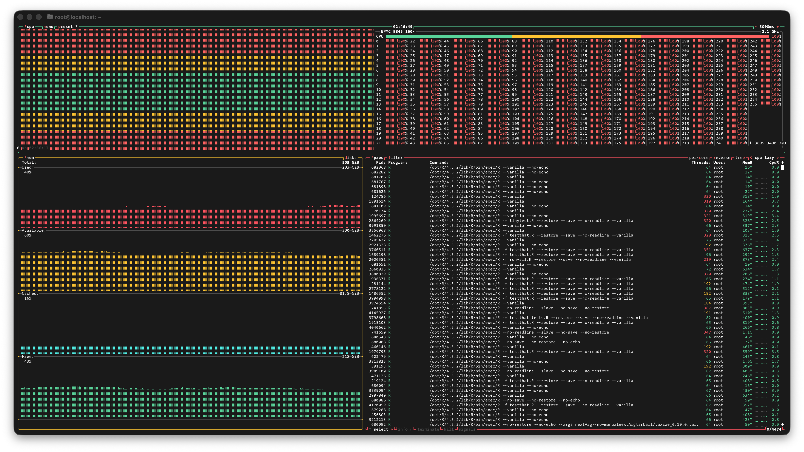

.
](/image/paul-kruger-gg0ZAFpRHHU-unsplash.jpg)

I'm excited to announce [revdeprun](https://github.com/nanxstats/revdeprun) 2.1.0,
a major update to my Rust CLI tool for automating R package reverse dependency checks.
This release is really two updates in one: version 2.0.0 accelerated dependency
installation, while 2.1.0 addressed two more bottlenecks I discovered during testing.
The combined result is a much faster workflow from start to finish.

You can install revdeprun from [crates.io](https://crates.io/crates/revdeprun):

```bash
cargo install revdeprun
```

If you're new to revdeprun, you might want to read the
[original announcement](https://nanx.me/blog/post/revdeprun/) first.
For full details of what changed, see
[PR #121](https://github.com/nanxstats/revdeprun/pull/121) (2.0.0),
[PR #125](https://github.com/nanxstats/revdeprun/pull/125), and
[PR #127](https://github.com/nanxstats/revdeprun/pull/127) (2.1.0).

## Optimizing the install scheduler in pak

When installing thousands of packages for a reverse dependency check[^1],
we want to fully use every CPU core we have. `pak::pkg_install()` is excellent
at this. It resolves dependencies from both CRAN and Bioconductor intelligently
and installs packages in parallel when possible.
But I noticed something odd: even on a 48-core or 256-core machine,
installing thousands of packages from binary and source does not feel
"butter smooth". The installed and built packages are not refreshing the
console fast enough, but almost one by one in small bursts.

[^1]: To run `R CMD check` on any reverse dependency, the minimal set of
      packages needed is: their hard dependencies recursively, plus their
      first-order soft dependencies, plus the hard dependencies of those
      first-order soft dependencies recursively.

The culprit turned out to be in pkgdepends, which pak embeds internally.
For a large set of packages, the install scheduler has two potential bottlenecks:

1. **Worker pool refill**: The event loop only starts exactly one
   new install task per poll iteration (every 100ms).
   When many small binary packages finish installing between polls,
   the worker pool might empty out faster than it refills.

2. **Dependency bookkeeping**: After every install, the scheduler updates
   dependency tracking for all remaining packages, even those that don't
   need it[^2].

[^2]: The [`deps_left`](https://github.com/r-lib/pkgdepends/blob/7938930cb073c610cb867a7a81b37bc5cc6a9f5a/R/install-plan.R)
      field tracks which dependencies still need to be installed.
      For packages that are already building from source, this bookkeeping
      could bring unnecessary overhead, considering this is an $O(n^2)$ operation.

The fix is straightforward: refill the worker pool up to `num_workers` after
each poll, and only update dependency tracking for packages that are not
packaged or built yet. I've shipped these more "aggressive" install scheduling
details as a monkey patch that revdeprun applies automatically before
running `pak::pkg_install()`, so your high core count instances can be fully
utilized without upstream changes.

## Squashing two more bottlenecks

After releasing 2.0.0, I ran the data.table speedrun and was pleased
with the installation improvements. But I noticed the overall time wasn't
as fast as I expected. So I had to dig deeper and found two more obvious issues.

### The mysterious hour-long preparation phase

During the `xfun::rev_check()` preparation phase, I was seeing an hour of
single-core work. What was going on?
It turned out that revdeprun installs all dependencies into a `revdep/`
subdirectory within the package directory. When `rev_check()` builds
a source tarball of the package, it was packing this **entire library**
into the archive... Not only did this slow things down dramatically,
it was also the source of a cryptic warning message I've been ignoring:

> Warning in utils::tar(filepath, pkgname, compression = compression, compression_level = 9L,  :
>   storing paths of more than 100 bytes is not portable:

The fix is simple: revdeprun now automatically adds `^revdep$` to the
`.Rbuildignore` file. That hour-long phase now only takes minutes.

### Serial tarball downloads

The second bottleneck was in downloading reverse dependency source packages.
`xfun:::download_tarball()` fetches packages one at a time, which meant
downloading 1,700+ tarballs was slower than it needed to be.

I've added a monkey patch in revdeprun that parallelizes this using
`parallel::mcmapply()` with 5 workers. I've also submitted
[PR #112](https://github.com/yihui/xfun/pull/112) to xfun
to make this improvement available to everyone.

## A new speedrun record

To verify if all these improvements are effective and correct, I reran the
data.table speedrun from
[my original speedrun post](https://nanx.me/blog/post/revdep-speedrun/).
To push the limits, I used a large cloud instance with the latest
generation of hardware. It costs $8.64 per hour:

- 256 CPU cores (AMD EPYC 9845, launched Q4 2024)
- 512 GB DDR5 RAM
- 5 TB storage
- Ubuntu 24.04 LTS

After booting up the instance, the setup is only five commands[^3]:

[^3]: With 256 cores, I hit the default file descriptor limit during
      parallel installations. The `ulimit` command raises this to a safe level.

```bash
curl --proto '=https' --tlsv1.2 -sSf https://sh.rustup.rs | sh
sudo apt-get update && sudo apt-get install -y build-essential
cargo install revdeprun
ulimit -n 10240
revdeprun https://github.com/Rdatatable/data.table.git
```

### The timeline

Here's how the run progressed:

**00:00:00** - Started. Setting up R and installing system dependencies.

**00:14:00** - Started downloading 4,430 packages required for checking.

**00:23:00** - Started installing packages. The 2.0.0 scheduler patch works here.

**00:49:00** - `xfun::rev_check()` started preparation. Thanks to the fix in
2.1.0, this phase now takes just minutes instead of an hour.

**00:53:00** - Started downloading all 1,732 reverse dependencies from source.
With parallel downloads, this takes about 3 minutes instead of 17 minutes.

**00:56:00** - Downloads finished. The real work begins:
run `R CMD check` on all 1,732 packages, twice[^4].

[^4]: Each package is checked twice: once against the released CRAN version
      and once against the development version. This lets you identify which
      check failures are new.

**01:28:00** - 866 packages remaining. Halfway there.

**02:44:00** - Finished! 35 packages reported check diffs.

Screenshot from the run:

```{r btop, echo=FALSE, out.width="100%", fig.cap="`btop` showing all 256 cores at 100% utilization during the checking phase."}

```

### Comparison with the previous run

```{css, echo=FALSE}
table.table tr {
  font-family: var(--tw-prose-font-serif);
}
```

```{r, echo=FALSE}
read.csv("speedrun.csv", header = TRUE) |>
  knitr::kable(table.attr = "class=\"table table-hover\"", format = "html", col.names = c("Metric", "Previous run", "This run"))
```

The headline number is **2 hours 44 minutes** from a cold start to
a complete reverse dependency check for one of CRAN's most depended packages.
A ~70% reduction from the original 8 hour 55 minute run.

The setup time dropped from over 2 hours to under an hour, thanks to
the combined effect of the scheduler patch, the `.Rbuildignore` fix, and
parallel downloads. The checking phase also scaled nicely with 256 cores,
though we'll often hit diminishing returns when we're bound by the
slowest individual package checks.

The ~$24 cost is quite reasonable considering the time saved.
For packages with fewer reverse dependencies, a smaller instance
would bring the cost down further.

## Acknowledgments

Thanks to Devin Pastoor for reminding me that [rv](https://github.com/A2-ai/rv),
a uv-inspired R package manager written in Rust, exists.
Although I didn't end up using it directly for
[technical reasons](https://github.com/A2-ai/rv/issues/351),
it confirmed that substantial speed improvements in the R package
installation toolchain are entirely possible.
