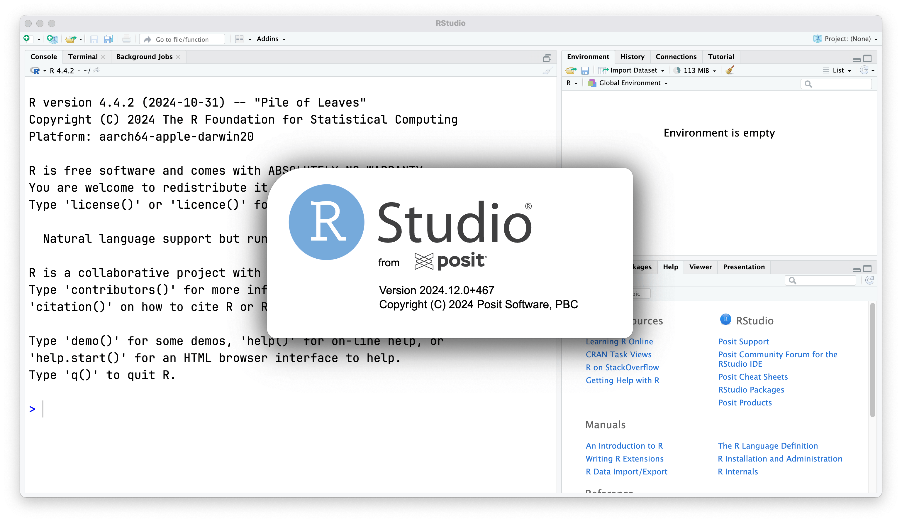

.
](/image/josh-hild-igLQW_yY9oo-unsplash.jpg)

::: {.callout}
**Update** (2025-05-05): RStudio release planned for August 2025 will
[include a global option](https://github.com/rstudio/rstudio/pull/15946)
to turn off the splash screen and support click-to-close behavior.
:::

```{css, echo=FALSE}
.callout p {
  font-weight: 410;
  font-size: 1rem;
  font-variation-settings: "opsz" var(--inter-opsz-16-450);
  letter-spacing: var(--inter-ls-16-450);
  margin-top: 1.25rem;
  margin-bottom: 1.25rem;
  padding-top: 1.25rem;
  padding-bottom: 1.25rem;
  padding-left: 1rem;
  padding-right: 1rem;
  border-radius: 0.25rem;
  border-left: 5px solid #64748b;
  border-right: 1px solid #cbd5e1;
  border-top: 1px solid #cbd5e1;
  border-bottom: 1px solid #cbd5e1;
}
```

Starting with RStudio IDE version 2024.12.0+467, a redesigned splash screen
replaces the previous app logo.
This change was introduced in
[rstudio/rstudio#15347](https://github.com/rstudio/rstudio/pull/15347)
and it looks like this:



While visually polished, the new splash screen feels slightly too shiny
(no pun intended) and adds a delay to the
[perceived time](https://web.dev/articles/user-centric-performance-metrics)
before I can first interact with the UI.
For research purporses, I was curious to see if skipping it was possible
and I found a simple solution. The relevant file is located at:

```text
resources/app/.webpack/renderer/splash/index.html
```

By replacing the first `<style>` block with the following line,
you can make the splash screen invisible:

```html
<style> body { display: none; } </style>
```

To apply this tweak, you can use the automation scripts below.

## macOS

Run the following two-liner in your terminal:

```bash
file="/Applications/RStudio.app/Contents/Resources/app/.webpack/renderer/splash/index.html"; \
awk 'BEGIN{RS="</style>"; ORS=""} NR==1 {sub(/<style>[^<]*$/, "<style> body { display: none; }")}; {print $0 RS}' "$file" > "$file.tmp" && mv "$file.tmp" "$file"
```

## Linux

On Linux, use the same `awk` command and adjust the file path.

For example, on Ubuntu, save this script as `patch_rstudio_splash.sh`:

```bash
file="/usr/lib/rstudio/resources/app/.webpack/renderer/splash/index.html"; \
awk 'BEGIN{RS="</style>"; ORS=""} NR==1 {sub(/<style>[^<]*$/, "<style> body { display: none; }")}; {print $0 RS}' "$file" > "$file.tmp" && mv "$file.tmp" "$file"
```

Make it executable and run it with `sudo`:

```bash
chmod +x patch_rstudio_splash.sh
sudo ./patch_rstudio_splash.sh
```

## Windows

Save the following as `patch_rstudio_splash.ps1`:

```powershell
$file = "C:\Program Files\RStudio\resources\app\.webpack\renderer\splash\index.html"

if (-Not (Test-Path -Path $file)) {
    Write-Error "File not found: $file"
    exit
}

$content = Get-Content -Raw -Path $file

$content = [regex]::Replace($content, "<style>.*?</style>", "<style> body { display: none; } </style>", 'Singleline')

Set-Content -Path $file -Value $content

Write-Output "Patch applied successfully: Splash screen is now invisible."
```

Open PowerShell as administrator:

- Open start menu, search for "PowerShell".
- Right-click "Windows PowerShell" and select "Run as administrator".
- Click "Yes" when prompted by User Access Control.

Run the script in the privileged window:

```batch
.\patch_rstudio_splash.ps1
```
