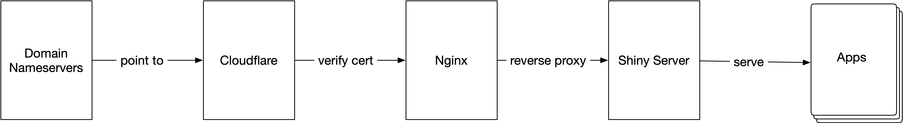

After procrastinating for some time, I finally set up a dedicated self-hosting server, [nanx.app](https://nanx.app), for my public shiny apps. From now on, most of the web applications listed on [my software page](https://nanx.me/software/) will be available from two mirrors --- the self-hosting server and the public cloud hosting solution [shinyapps.io](https://www.shinyapps.io) kindly provided by Posit.

## The Motivation

I have built many shiny apps over the years --- a few of them are public and open source. As a fully managed solution, shinyapps.io has provided a handy and flexible enough hosting venue for 95% of the apps I built.

It wasn't always rainbows and butterflies, though. Sometimes, I feel I still need extra flexibility and control over the system environments, especially when we can now use the incredible [reticulate](https://rstudio.github.io/reticulate/) to call Python modules directly. One example is my recent app [cwl-upgrader](https://github.com/nanxstats/cwl-upgrader), where the dependency could not be easily installed and discovered by the correct version of Python (if any) on shinyapps.io. To host this app, I decided to set up my own server.

In my opinion, the main technical reasons to create a self-hosting server may include:

- Better technical flexibility.
  - Install and use any "non-standard" dependencies.
  - Explore new web frameworks such as [Dash for R](https://twitter.com/nanxstats/status/1155992482993205251) and [Fiery](https://github.com/thomasp85/fiery).
- Better personal branding.
  - All apps are accessible under a single, personalized domain.
- Better pricing model.
  - Switch from time usage-based pricing to traffic-based pricing (harder to exhaust for me).
  - HTTPS for the custom domain with no nominal cost.

## The Setup

In brief, it looks like this:

Cloudflare handles the SSL, CDN, traffic scrubbing tasks, which simplifies things a lot. I used Linode for the cloud hosting part, but you can use any other vendors. I find these tutorials most useful during the process:

- [How to secure your server](https://www.linode.com/docs/products/compute/compute-instances/guides/set-up-and-secure/)
- [How to set up Cloudflare with Linode](https://www.linode.com/docs/guides/how-to-set-up-cloudflare-with-linode/)
- [Running Shiny Server with a proxy](https://support.posit.co/hc/en-us/articles/213733868-Running-Shiny-Server-with-a-Proxy)

It may take some time to figure out every detail when setting things up (DevOps can be intimidating), but one can often get it done after a little research. For example, two ops related issues I encountered:

- When uploading "large" files under the default Nginx settings, it returned a "413 Request Entity Too Large" error. We can usually set the `client_max_body_size` in `nginx.conf` to resolve this issue.
- On the $5/month 1GB RAM node I used, [compiling some particular dependencies](https://github.com/RcppCore/RcppEigen/issues/53) can max out the memory. I just temporarily resized the node to a bigger RAM node to compile them, and then resized back.
