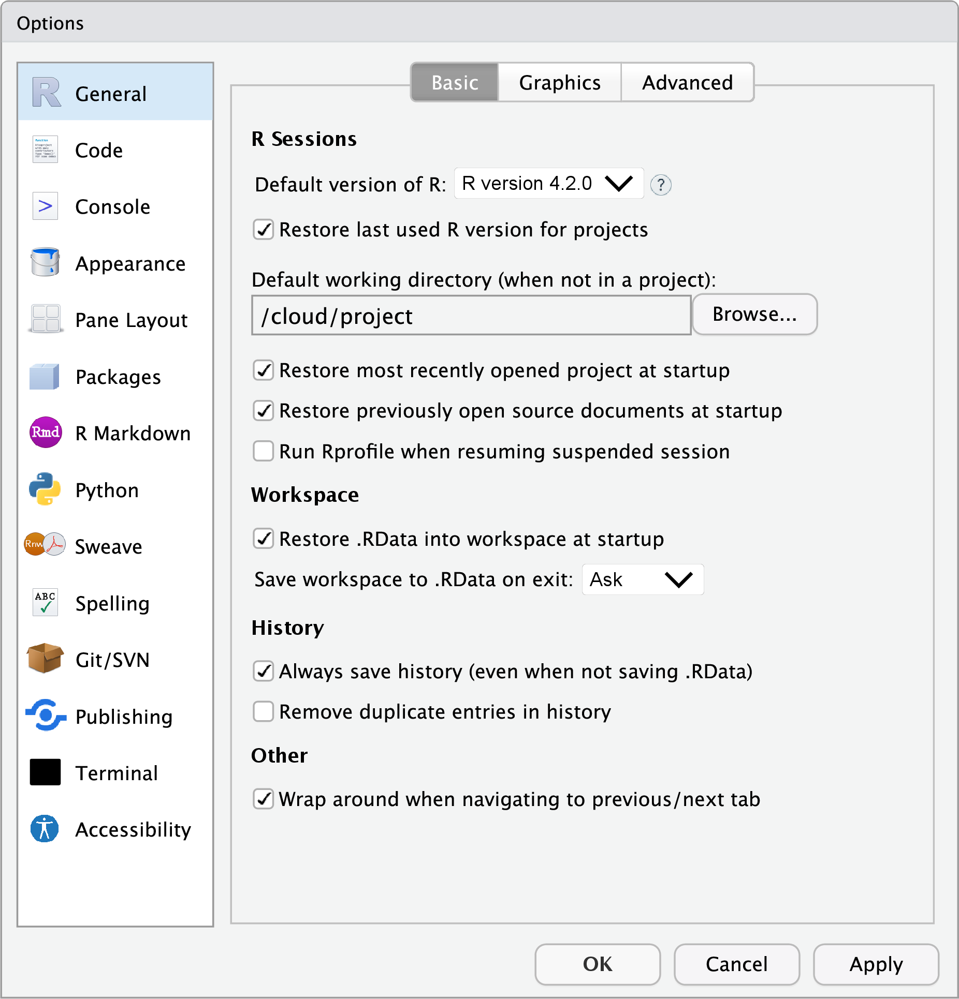

.](/image/thomas-reaubourg-JRUVbgJJTBM-unsplash.jpg)

## gtsummary

The other day, I looked into Daniel Sjoberg's
[gtsummary](https://www.danieldsjoberg.com/gtsummary/)
package for summarizing tabular data and regression models.
The README says:

> The {gtsummary} package summarizes data sets, regression models, and more,
> using <mark>sensible defaults</mark> with highly customizable capabilities.

The concept of having sensible defaults in (research) software immediately
resonated with me. Ideally, the default settings in software should be
able to support the majority of users' needs.
Furthermore, it means we can perform a task without worrying about its many
parameters while still being able to tweak them if we need to.
Simply put, sensible defaults in software will save time and effort
for researchers and help them focus on the science.

## ggsave()

The [`ggplot2::ggsave()`](https://ggplot2.tidyverse.org/reference/ggsave.html)
function is another good example.
It automatically sets sensible defaults for each plot format so that we can
write `ggsave("output.png")` with the expectation that it will work reasonably well.

In contrast, the classic
[graphical device](https://bookdown.org/rdpeng/exdata/graphics-devices.html)
implementations often guide us to be aware of the state of the devices,
and they often require us to [tune the details](https://ragg.r-lib.org/)
to improve output quality as the default outputs tend to be too small.

It is worth noting that both designs make sense because the goals of `ggsave()`
and graphical devices are different: ggplot2 aims to provide something that
works out of the box for a specific plotting system, while the graphical devices
need to be much more low-level and generic.

## "off-the-shelf"

This discussion reminds me of another term, "off-the-shelf," which is often
seen in Leo Breiman's seminal work on statistical methodology.
Prof. Michael Jordan discussed this briefly in his
[article](https://doi.org/10.1214/10-AOAS387):

> Another preferred piece of Breimanesque terminology was
> "<mark>off-the-shelf</mark>," again a rather physical metaphor.
> Leo tended to be suspicious of "free parameters"; procedures should work with
> little or no "tuning." Whenever I might tell Leo about a project of mine that
> had a Bayesian flavor this suspicion would come to the fore.
> While this might seem inconsistent with the notion of the
> "statistician as artist," the more refined notion is perhaps that of the
> "statistician as artisan." Hammers and screwdrivers don't tend to have free
> parameters. Leo wanted each of the basic tools to do one job and do it well.

If we can make some sophisticated statistical methods "off-the-shelf",
perhaps we should attempt to make statistical software operate similarly.

## Exercise

Can you point out which option(s) you will change after
a fresh installation in the screenshot below?
([Hint 1](https://rstats.wtf/save-source.html),
[Hint 2](https://rmd4sci.njtierney.com/rstudio-what-and-why.html)).

```{r, echo=FALSE, out.width="100%"}

```

I believe that the default options to restore and save `.RData` are not sensible
to most users, just like
[`stringsAsFactors = TRUE`](https://developer.r-project.org/Blog/public/2020/02/16/stringsasfactors/)
and [`drop = TRUE`](https://win-vector.com/2018/02/27/r-tip-use-drop-false-with-data-frames/).
These defaults should be changed from the user's side so that R works in the
best way possible, but there might be
[good reasons](https://community.rstudio.com/t/defaults-of-saving-and-restoring-workspace/939/2)
not to change them from the software developer's side---because one might
face a [difficult choice](https://yihui.org/en/2018/11/biggest-regret-knitr/)
between doing the right thing and not breaking user's code that worked.
