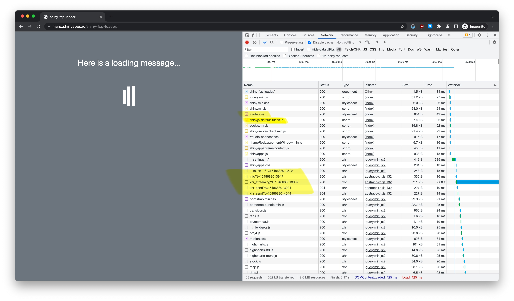
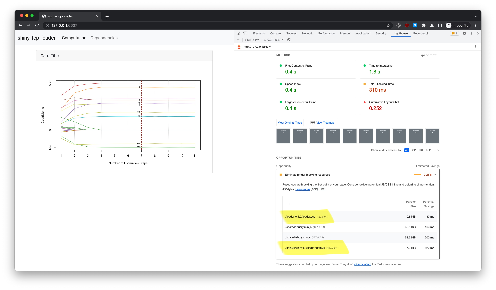

```{r, include=FALSE}
knitr::opts_chunk$set(
  comment = "#>",
  message = FALSE
)
```

> The Shiny app skeleton is available from
> [nanxstats/shiny-fcp-loader](https://github.com/nanxstats/shiny-fcp-loader).

.](/image/emma-fabbri-Vfs_zlhQr0o-unsplash.jpg)

More than a few people asked me similar questions about this when building
large shiny apps. Therefore, it might be time to formulate a simple solution
with a minimalist yet extensible code demo.

## UX side effects of large Shiny apps

For larger Shiny apps, users could wait a long time (in terms of 10s of seconds)
with an embarrassing blank screen before seeing the rendered app content.
There are many possible reasons, but the common ones are:

- Loading a considerable number of render-blocking CSS/JS dependencies.
- Initializing the app state with some intensive computation.
- Connecting to servers with bandwidth and response time limitations.

## The solution

I created an example app at <https://github.com/nanxstats/shiny-fcp-loader>,
with a demo deployed at <https://nanx.shinyapps.io/shiny-fcp-loader/>.
The goal is to minimize the [First Contentful Paint (FCP)](https://web.dev/fcp/) time.

This Shiny app solves the problems on the app code level by:

- Implementing a loading screen (loader); hiding it after the main UI resources
  are loaded + the state initialization is finished.
- Prioritizing loading the loader-related code (mostly CSS, maybe JS) so it can
  render before the main UI assets.
- Loading and rendering the main UI assets later separately without blocking
  the rendering of the loader.

## Technical details

Here is how the logic looks at the entry point of the Shiny app (`app.R`):

```{r, eval=FALSE}
ui <- function(request) {
  tagList(
    useLoader(),
    shinyjs::useShinyjs(),
    uiOutput("ui_main")
  )
}

server <- function(input, output, session) {
  output$ui_main <- renderUI(source("ui/main.R", local = TRUE)$value)
  source("server/main.R", local = TRUE)$value
  shinyjs::delay(15000, shinyjs::hide("loading"))
}

shinyApp(ui, server)
```

- The CSS loader is formally defined by using `htmltools::htmlDependencies()`
  and then attached so that it can be loaded first as an isolated dependency.
- Instead of defining the main UI directly in the UI function, we render the UI
  using `renderUI()` on the server side and used `uiOutput()` to output it.
  This makes the main UI loaded and rendered separately after the loader.
- The loader should be hidden when the main UI assets are loaded,
  while we also want to cover the case where the lengthy initialization is
  from computing. Therefore, we added a delay as another safeguard.
  One can tune the delay parameter (in ms) if they have a rough estimate for
  the computation to finish based on where the app is deployed.

I also applied the idea of [Atomic Design](https://atomicdesign.bradfrost.com/)
to decouple the UI and server components so that the app structure is easy to
understand and scale.

## Waterfall chart

Let's check how the app is loaded using the waterfall chart in Chrome DevTools
under the Network tab:

```{r, echo=FALSE, out.width="100%"}

```

We can see that our loader is loaded and rendered at the very beginning, way
before the XHR requests (which could be WebSocket requests in other cases)
in the middle. These requests would trigger the rendering and loading of
the main UI assets.

To see how a minimal first contentful paint time helps more dramatically,
you can simulate a limited bandwidth scenario by selecting Chrome DevTools →
Network → Throttle → Fast 3G. This limits the loading speed of all resources.

## Lighthouse

We can also measure the page loading performance using
[Lighthouse](https://developers.google.com/web/tools/lighthouse).

It took 0.4 seconds (locally) to achieve First Contentful Paint.
We only have 4 render-blocking resources: two from the loader,
two from Shiny essentials.

```{r, echo=FALSE, out.width="100%"}

```

I hope this example could help you build large Shiny apps with a
better user experience in the future.

## Bonus thoughts

The `->` assignment operator makes more sense logically and aesthetically
if we write the server code like below, especially if you use a coding font
with programming ligatures for `|>` and `->`:

```{r, eval=FALSE}
server <- function(input, output, session) {
  source("uiuiui/main.R", local = TRUE)$value |> renderUI() -> output$ui_main
  source("server/main.R", local = TRUE)$value
}
```

I guess this feeling was also discussed
[here](https://win-vector.com/2016/12/12/the-case-for-using-in-r/) by John Mount.
