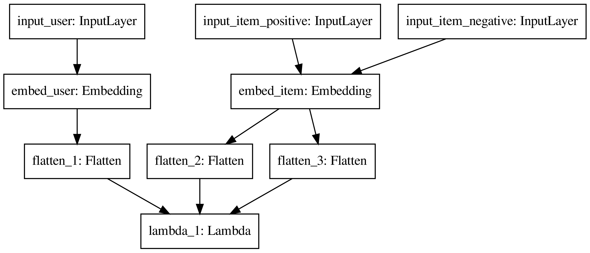
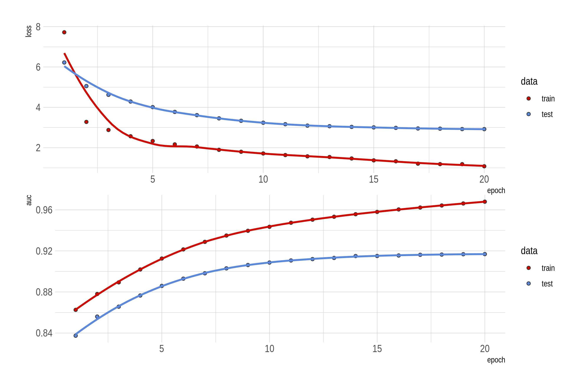
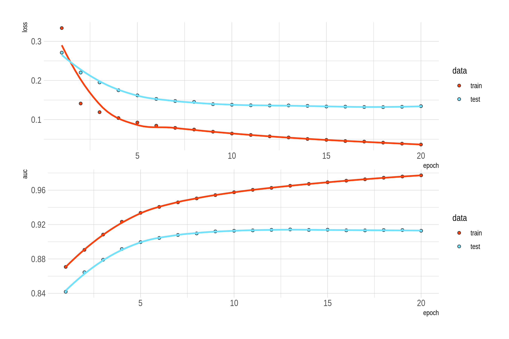

All the R code for this post is available on GitHub: [nanxstats/deep-learning-recipes](https://github.com/nanxstats/deep-learning-recipes).

 by Jamie Davies](/image/three-palms-jamie-davies.jpg)

At the end of our [last post](https://nanx.me/blog/post/recsys-binary-implicit-feedback-r-keras/), I briefly mentioned that the triplet loss function is a more proper loss designed for both recommendation problems with implicit feedback data and distance metric learning problems. For its importance in solving these practical problems, and also as an excellent programming exercise, I decided to implement it with R and Keras.

## Triplet Loss

The triplet loss makes us focus on the core of many supervised/unsupervised learning problems: learning better representations for data. The idea is pretty simple: we want to learn a custom distance metric or (low-rank) representation for our data, such that under this new metric or representation, the distance between "similar" observations is smaller, and the distance between "dissimilar" observations is larger. Here the definition of "similar" or "dissimilar" observations may come from some side information.

The idea of learning a global Mahalanobis distance metric was first formalized by [Xing et al.](https://dl.acm.org/citation.cfm?id=2968618.2968683) as a convex optimization problem. The [LMNN by Weinberger and Saul](http://jmlr.csail.mit.edu/papers/volume10/weinberger09a/weinberger09a.pdf) is the work that first formulated the metric learning problem as a localized large margin learning problem with "triplets", partially inspired by the SVM objective function. The triplet loss was further popularized by the [FaceNet by Schroff et al.](https://arxiv.org/abs/1503.03832) in the computer vision and especially the face recognition community. A margin-based triplet loss function looks like this:

$$L_\text{margin}(a, p, n) = \sum \max(0, f(a, p) - f(a, n) + \varepsilon)$$

where $a$ is an "anchor" observation. $p$ is the "positive" sample which should be closer to $a$ than the "negative" sample $n$. We will need many such triplets $\{a, p, n\}$. $f$ is the transformation we want to learn. $\varepsilon$ is a constant number larger than zero (tuning parameter). A natural interpretation of the loss function: the learned metric should separate the negative sample $n$ from the positive sample $n$ at least by a positive margin $\varepsilon$.

## Data and Model

To make things easier to understand, this time we will use the MovieLens data as the example. Naturally, we will also use the jargon of users/items to denote the two parties presented in a recommender system.

We binarized the 1 to 5 ratings to make it binary (interacting or non-interacting user-item pairs) implicit feedback data. To construct the triplets, we sample from the interacting user-items pairs and combine them with randomly sampled non-interaction items for the users.

The model looks like this:

From the figure, the low-rank, dense embeddings for users and items are the inputs for the loss function (the Lambda layer). By minimizing the loss function, we achieved our goal: learning representations for users and items. Note that the embedding layer for items is shared by the positive and negative items since they are inherently both items thus should use the same representation.

## Implementation

Unlike our [last post](https://nanx.me/blog/post/recsys-binary-implicit-feedback-r-keras/) which modeled this as a classification problem, we don't have the "labels" in the traditional sense here. Instead, the training loss itself will be the output as is shown above. Therefore, it is a little tricky to implement this with Keras because we need to build a custom loss function, build a custom metric function, and finally, build a custom prediction function. This is precisely why it would be a good programming exercise.

The closest [reference implementation](https://github.com/maciejkula/triplet_recommendations_keras) I could find is written in Python. Unfortunately, the code is a bit outdated and doesn't play well with the latest Keras API. So I reimplemented the model in R and made it running on the latest Keras and Tensorflow backend successfully, with the help of the functional style [lambda layers](https://keras.io/layers/core/#lambda).

## Performance Evaluation

The custom performance metric we implemented is a user-averaged AUC. In essence, for each user in the test set, we predict the probability if an item will be preferred by the user on all items in the test set. We then compute the AUC based on these predictions for this user, do this for all users, and average all the AUC values. Intuitively, this metric can roughly reflect the probability that a randomly selected positive item will be ranked higher than a randomly selected negative item for users.

The loss and AUC change on the training/test set is visualized below.

## The BPR Triplet Loss

What our reference implementation had is another type of triplet loss, namely, the [Bayesian Personalized Ranking (BPR) loss](https://arxiv.org/abs/1205.2618):

$$L_\text{BPR}(a, p, n) = \sum \big(1 - \sigma(f(a, p) - f(a, n)) \big)$$

where $\sigma$ is the sigmoid function. For the sake of completeness, I also implemented it. It has a strikingly similar performance to the margin-based model for our data here, while it converges faster with the benefit of not needing to tune the margin parameter of the loss.

## Comments

**Hard negative mining.** A crucial aspect for improving the performance of models with a triplet loss is about selecting or constructing more hard-to-learn triplets which can help you learn the representations or metrics better. This is often called the "hard negative mining" problem. The [FaceNet paper](https://arxiv.org/abs/1503.03832) described their triplet selection approach. Here is also a [good post](https://omoindrot.github.io/triplet-loss) explaining more details on this.

**Applications.** The bar of applying this method is relatively low because sometimes the required data is more accessible than fully labeled data. Conceptually, this idea can be applied to any learning problems where we can construct the triplets. An extreme case is the recsys with implicit feedback data we just showed: we only know the relative preference between entities (e.g., user's relative preference for items). The more common scenarios are where the true labels of data are difficult to get, but one might know the distance/similarity relationships between entities (images, text, human genomes).
