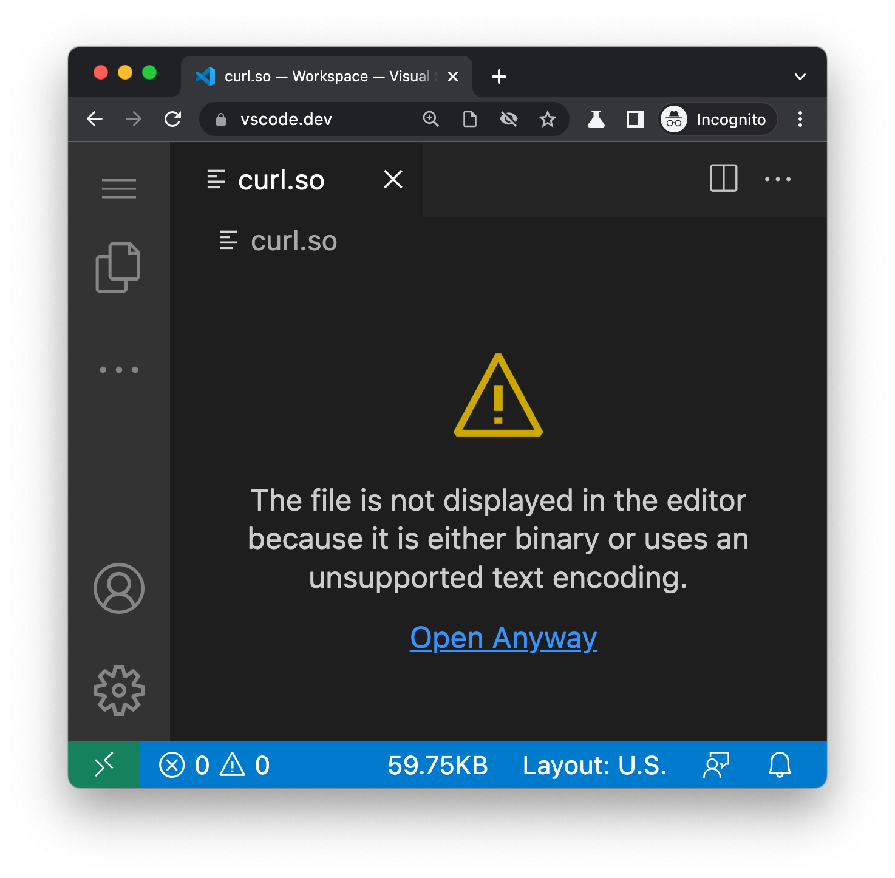

```{r, include=FALSE}
knitr::opts_chunk$set(
  comment = "#>",
  message = FALSE
)
```

> The R code in this post is also available at
> [this GitHub Gist](https://gist.github.com/nanxstats/de5b08990aad2298a39aca347772304f).

.](/image/alp-duran-vLuj--T3Fp8-unsplash.jpg)

## Intro

In some situations, we want to know whether a file is a text file or a
binary file programmatically.
For example, as a text editor developer, you can use this information
to choose the correct editing interface (text editor or hex editor).
Similarly, if you want to [pack](https://github.com/Merck/pkglite/issues/18)
or compress a collection of files into a compact format, it helps to know
the type of file before encoding them.

```{r, echo=FALSE, out.width="100%"}

```

One way to determine a file's type is by looking at its file extension.
This method has some obvious pros and cons. It is fast because we only
need to know the file name and compare it with a dictionary—but that
approach is not 100% reliable—files with the same extension can be
either text or binary in rare cases, such as
[.RData/.rda files](https://www.loc.gov/preservation/digital/formats/fdd/fdd000470.shtml).
It also cannot handle ambiguous cases such as files without extensions.

Another possibility is to use content-based methods with heuristics (rules).
After some research, I found a simple yet accurate algorithm
from [zlib](https://en.wikipedia.org/wiki/Zlib), the foundational
library for data compression for many important software.

## The algorithm

The algorithm is described in
[doc/txtvsbin.txt](https://github.com/madler/zlib/blob/8678871f18f4dd51101a9db1e37791f975969079/doc/txtvsbin.txt), as quoted below.

> The algorithm works by dividing the set of bytecodes [0..255] into three
> categories:
>
> - The allow list of textual bytecodes:
>
>   9 (TAB), 10 (LF), 13 (CR), 32 (SPACE) to 255.
>
> - The gray list of tolerated bytecodes:
>
>   7 (BEL), 8 (BS), 11 (VT), 12 (FF), 26 (SUB), 27 (ESC).
>
> - The block list of undesired, non-textual bytecodes:
>
>   0 (NUL) to 6, 14 to 31.
>
> If a file contains at least one byte that belongs to the allow list and
> no byte that belongs to the block list, then the file is categorized as
> plain text; otherwise, it is categorized as binary.  (The boundary case,
> when the file is empty, automatically falls into the latter category.)

The original file describes the classification performance in great detail.
The take-home message is that it has "near-100% recall and much increased
precision"—that is, almost all text files will be correctly classified as
text files regardless of the language, but some binary files may be
misclassified as text files.
Compared to a high-precision, low-recall scenario,
I think this trade-off makes sense for many real-world applications
because we often prefer to maximize the number of files where humans
can inspect with eyes. If a "binary" file is misclassified due to it
containing mostly or only textual data, that is ok.

## R implementation

Here is an R implementation of the algorithm.

```{r}
#' Classify any file into text or binary
#'
#' @param path File path.
#' @param n The (maximal) number of bytes to read.
#'
#' @return Logical. `TRUE` if text, `FALSE` if binary.
#'
#' @examples
#' is_text_file(file.path(R.home("doc"), "COPYING"))
#' is_text_file(file.path(R.home("doc"), "NEWS.pdf"))
is_text_file <- function(path, n = file.info(path)$size) {
  bytecode <- readBin(path, what = "raw", n = n)

  if (length(bytecode) == 0L) return(FALSE)

  allow <- as.raw(c(9, 10, 13, 32:255))
  block <- as.raw(c(0:6, 14:31))

  cond1 <- any(bytecode %in% allow)
  cond2 <- !any(bytecode %in% block)

  cond1 && cond2
}
```

If you are concerned with reading large files, and would like to limit the
I/O or memory consumption, set `n` to the maximal number of bytes to read.

## Experiment

I will use the ~3,000 files from my local R installation and analyze the
complete file or only their first 100 KB to determine if they
are text or binary.

```{r, cache=TRUE}
is_text_files <- Vectorize(is_text_file, "path")
df <- data.frame(
  file = fs::dir_ls(R.home(), type = "file", recurse = TRUE),
  is_text = NA,
  is_text_100k = NA,
  row.names = NULL,
  stringsAsFactors = FALSE
)

# Use the entire file
system.time(df$is_text <- is_text_files(df$file))
# Use the first 100 KB (at maximum)
system.time(df$is_text_100k <- is_text_files(df$file, n = 0.1 * 1000^2))
all.equal(df$is_text, df$is_text_100k)
```

We got 100% concordance between the full-file and first-100 KB versions.
The 100 KB version only took 28% as long to process as its counterpart:
perhaps some big files were included in the test files.
You can filter the detailed results in the table below.

<style>
div.dataTables_paginate { font-size: 12px; }
table { font-variant-numeric: tabular-nums; }
</style>

```{r, echo=FALSE}
df$file <- gsub(paste0("^", fs::path_norm(R.home()), "/"), "", df$file)
exts <- fs::path_ext(df$file)
df$exts <- as.factor(exts)
DT::datatable(
  df,
  rownames = FALSE,
  colnames = c("File", "All", "100k", "Extension"),
  options = list(dom = "<'top'i>rt<'bottom'p><'clear'>"),
  filter = list(position = "top", clear = FALSE)
) |>
  DT::formatStyle(columns = c(1, 2, 3, 4), fontSize = "16px") |>
  DT::formatStyle("file", fontSize = "12px")
```

<p></p>

## Finding anti-patterns

These results seem to follow common sense. At the same time,
we might be able to learn something by looking for anti-patterns
in the results, such as inconsistent file type labels within files
sharing the same file extension.

```{r}
flag <- rep(FALSE, nrow(df))

for (i in unique(exts)) {
  if (i != "") {
    idx <- which(exts == i)
    val <- df[idx, "is_text"]
    if (length(unique(val)) > 1L) {
      flag[idx[val == as.logical(names(which.min(table(val))))]] <- TRUE
    }
  }
}
```

```{r, echo=FALSE}
DT::datatable(
  df[flag, ],
  rownames = FALSE,
  colnames = c("File", "All", "100k", "Extension"),
  options = list(dom = "<'top'i>rt<'bottom'><'clear'>")
) |>
  DT::formatStyle(columns = c(1, 2, 3, 4), fontSize = "16px") |>
  DT::formatStyle("file", fontSize = "12px")
```

<p></p>

When you open [EmbeddedNuls.csv](https://github.com/wch/r-source/blob/4bfd8cb40228db27f04ab4b330d3a50e85a1aaae/tests/EmbeddedNuls.csv)
and [WinUnicode.dat](https://github.com/wch/r-source/blob/4bfd8cb40228db27f04ab4b330d3a50e85a1aaae/tests/WinUnicode.dat)
in a hex editor, you will see that EmbeddedNuls.csv is a normal CSV file
but with nulls (`00`) embedded in the data, whereas WinUnicode.dat is a
UCS-2 encoded file with some nulls (`00`) in it as well,
plus other control characters.
Aha! It turns out we correctly classified these files as binary—they are
just special cases.
